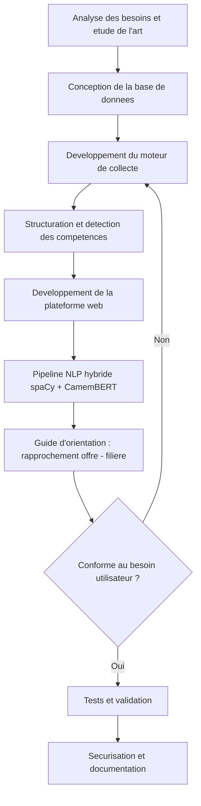
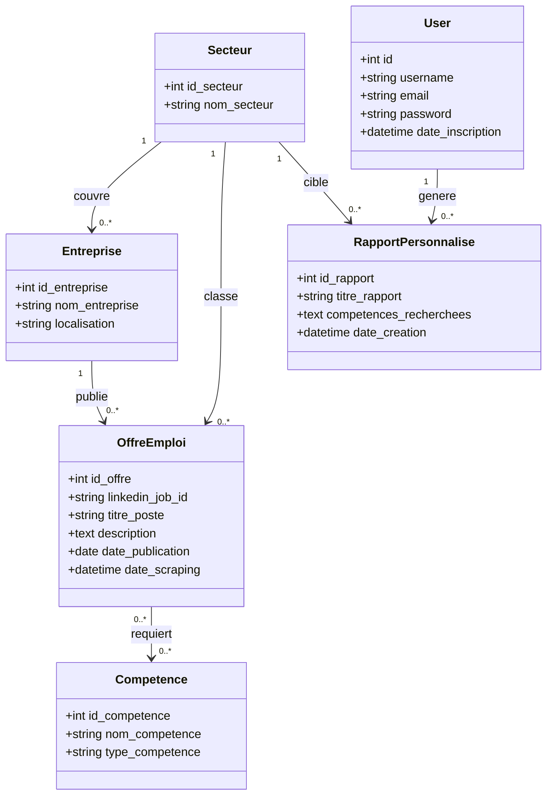
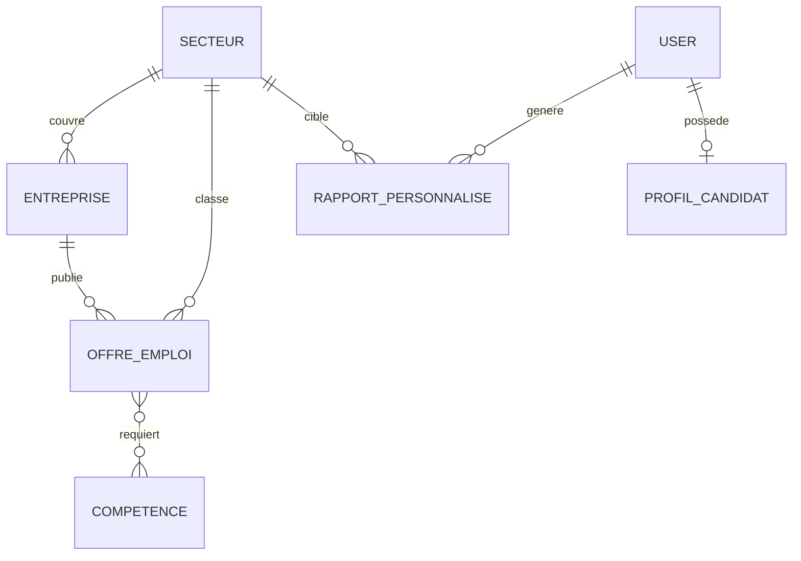
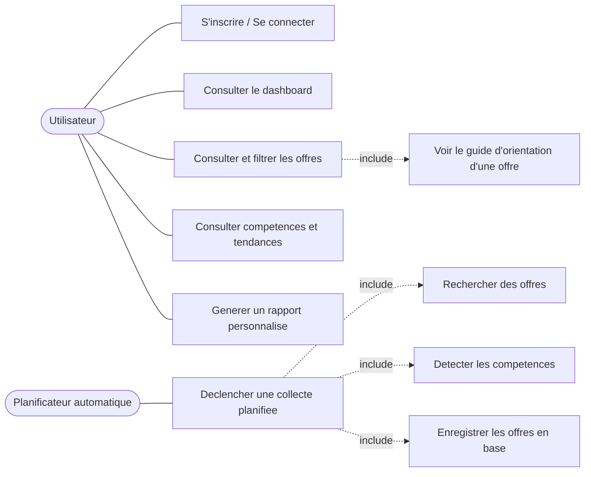
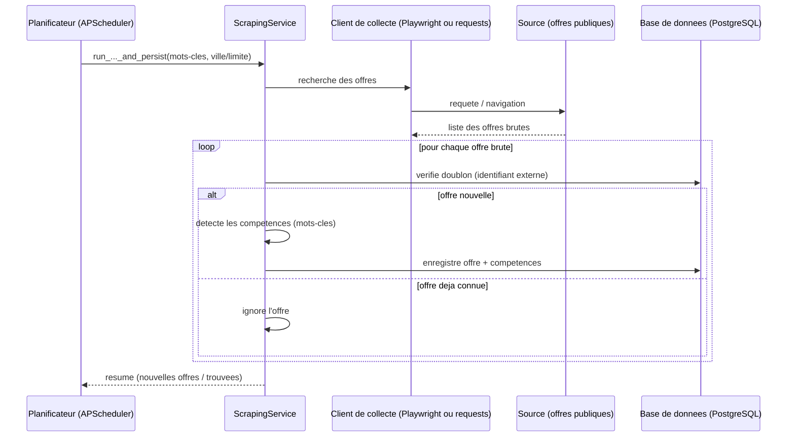

# Mémoire de fin d'études

**Exploration, structuration et analyse des offres d'emploi en Afrique de l'Ouest en vue d'orienter les étudiants vers les filières universitaires adaptées au marché du travail.**

---

## INTRODUCTION GENERALE

L'Afrique de l'Ouest francophone connaît, depuis plusieurs années, une expansion continue de la publication d'offres d'emploi en ligne, portée par la numérisation progressive des cabinets de recrutement, des sites d'annonces locaux et des plateformes professionnelles internationales. Cette abondance de données brutes ne se traduit cependant pas automatiquement en une information exploitable : dispersées sur des dizaines de sites hétérogènes, rédigées sans structure commune, et rarement reliées à un parcours de formation concret, ces offres restent difficiles à interpréter pour un étudiant cherchant à orienter ses choix académiques.

Dans ce contexte, un étudiant ou un jeune diplômé qui souhaite s'orienter professionnellement ne dispose généralement d'aucune vision claire, chiffrée et à jour du marché de l'emploi : quels secteurs recrutent réellement, quelles compétences reviennent le plus souvent dans les offres publiées, et surtout, quelle filière universitaire ou quel centre de formation permettrait d'y accéder. Construire cette vision manuellement, offre après offre, est long, non reproductible et rapidement obsolète face au renouvellement constant des annonces.

C'est dans cette perspective que s'inscrit le présent travail. Il porte sur la conception et la mise en œuvre d'une plateforme numérique dénommée **« Guide Universitaire »**, destinée à collecter automatiquement des offres d'emploi publiques centrées sur le Burkina Faso et l'Afrique de l'Ouest francophone, à les structurer en base de données relationnelle, à en restituer les tendances sous forme de tableaux de bord accessibles à un public non technique, et — au-delà de la seule restitution statistique — à rapprocher chaque offre consultée d'une filière universitaire et de centres de formation concrets permettant d'y accéder.

L'hypothèse fondamentale qui sous-tend ce travail est qu'une collecte et une structuration automatisées des offres d'emploi, couplées à un mécanisme de rapprochement vers l'offre de formation existante, peuvent fournir à un étudiant une base de décision d'orientation fiable et actualisée, sans exiger de lui la moindre compétence technique ni la moindre action manuelle de collecte.

Ce mémoire est structuré en trois chapitres complémentaires. Le premier situe le projet par rapport aux solutions professionnelles déjà existantes sur le marché de l'analyse des données d'emploi, et pose le cadre conceptuel nécessaire à sa compréhension. Le second décrit la démarche méthodologique retenue, de la conception de la base de données jusqu'au développement du mécanisme de rapprochement vers les filières universitaires. Le troisième présente les résultats obtenus sur données réelles, les discute au regard de l'état de l'art, et en assume explicitement les limites.

---

## CHAPITRE I : REVUE DE LITTERATURE ET CADRE CONCEPTUEL

### I. État de l'art des solutions existantes

Avant de concevoir « Guide Universitaire », un état des lieux des solutions déjà disponibles sur le marché de l'analyse des données d'emploi a été mené, afin de situer précisément l'apport du présent projet par rapport à l'existant plutôt que de le présenter comme une innovation isolée.

#### I.1 Textkernel

**Description générale.** Textkernel est une entreprise qui vend des logiciels aux services RH et aux agences de recrutement pour les aider à trier les CV et trouver les bons candidats plus vite, grâce à l'intelligence artificielle.

**Fonctionnement.** On lui fournit un CV, dans n'importe quelle langue, et le logiciel lit et comprend automatiquement son contenu (nom, expérience, compétences, diplômes) — comme si un robot remplissait une fiche à la place de l'utilisateur. Il peut ensuite chercher, parmi des milliers de CV, celui qui correspond le mieux à une offre d'emploi, même si les mots utilisés diffèrent (il comprend les synonymes). Il fournit également des informations sur le marché de l'emploi : quelles entreprises recrutent, pour quels métiers, avec quelles compétences.

Cet outil est exclusivement utilisé par des grandes et moyennes entreprises, des agences d'intérim et des cabinets de recrutement : c'est un outil professionnel, non destiné au grand public.

**Forces.** Facile à utiliser, rapide, capable de comprendre plusieurs langues de CV.

**Faiblesses.** Prix caché (il faut le demander directement à l'éditeur pour le connaître), interface uniquement en anglais, réservé aux entreprises — pas conçu pour un étudiant, un élève, ni pour le grand public.

*Source : capterra.com/p/126982/Textkernel*

#### I.2 Lightcast

**Description générale.** Lightcast est une entreprise qui collecte des milliards d'offres d'emploi dans le monde entier (165 pays) et en tire des statistiques : quels métiers recrutent, quelles compétences sont demandées, où, et à quel salaire.

**Fonctionnement.** Lightcast aspire automatiquement des offres d'emploi partout sur Internet, jour après jour, et transforme ces données brutes en chiffres et graphiques (« la demande pour tel métier a augmenté de X % ce trimestre », « voici les compétences les plus recherchées dans tel secteur »). L'outil sert surtout aux gouvernements, universités et grandes entreprises pour anticiper leurs besoins en formation ou en recrutement.

Cette solution est utilisée par des décideurs (RH stratégiques, universités, collectivités), non par des particuliers ; elle est coûteuse et pensée pour des analyses à grande échelle plutôt qu'un usage individuel.

**Forces.** Volume de données considérable (de l'ordre du milliard d'offres et plus), couverture mondiale, forte fiabilité.

**Faiblesses.** Coût très élevé, conçu pour de gros clients institutionnels — inaccessible à un particulier, qu'il s'agisse d'un étudiant, d'un élève ou de tout apprenant.

*Source : lightcast.io (page d'accueil)*

#### I.3 LinkedIn Talent Insights

**Description générale.** LinkedIn Talent Insights est un outil vendu par LinkedIn aux entreprises pour observer, en temps réel, qui travaille où, quelles compétences ont les personnes sur un marché donné, et comment positionner leur entreprise face à la concurrence pour attirer des talents.

**Fonctionnement.** L'outil exploite l'ensemble des données des profils LinkedIn (plus de 900 millions de personnes) pour répondre par exemple à : « combien de développeurs Python sont disponibles au Burkina Faso ? » ou « votre entreprise perd-elle des talents plus vite que ses concurrents ? ». Il sert à préparer une stratégie de recrutement, pas à chercher soi-même un emploi. Les principaux utilisateurs sont les équipes RH des entreprises abonnées à LinkedIn Recruiter / Talent Solutions.

**Forces.** Des données uniques — plus de 900 millions de profils professionnels réels, mis à jour directement par les utilisateurs eux-mêmes, ce qu'aucun concurrent ne peut égaler — disponibles en temps réel : dès qu'une personne change d'emploi ou de compétence, l'outil le reflète immédiatement, contrairement aux rapports périodiques des solutions concurrentes.

**Faiblesses.** Réservé aux entreprises abonnées à LinkedIn Recruiter / Talent Solutions, dont le coût est élevé et inaccessible au grand public. Un étudiant ou un particulier ne peut donc jamais y accéder, même pour consulter ses propres tendances de carrière.

*Source : linkedin.com/products/linkedin-talent-insights*

#### I.4 Sources de collecte locales explorées

Au-delà des solutions d'analyse à grande échelle ci-dessus, la piste d'une simple diversification des sources de collecte sur des sites d'emploi propres au Burkina Faso a également été explorée, avant l'implémentation du moteur de collecte du projet. Sept sites candidats ont été identifiés et vérifiés individuellement ; six ont dû être écartés, chacun pour une raison distincte constatée lors d'une vérification directe plutôt que supposée :

| Site | Résultat de la vérification | Décision |
|---|---|---|
| emploiburkina.com | Bloqué (HTTP 403, protection anti-robot Cloudflare + politique explicite de contrôle de la collecte automatisée dans son robots.txt) | Écarté |
| bfemploi.com | Bloqué (HTTP 415 sur toute requête, y compris `robots.txt`, pare-feu applicatif actif) | Écarté |
| afriqueemplois.com | Robots.txt permissif, mais site en application JavaScript côté client (SPA) : les pages d'offres consultées directement redirigent vers l'accueil sans contenu, une collecte fiable nécessiterait un navigateur automatisé (Playwright), avec la même fragilité que LinkedIn | Écarté pour l'instant |
| tonjob.net | Serveur injoignable au moment du test (délai dépassé) | Écarté |
| fr.jooble.org (agrégateur) | Bloqué (HTTP 403) ; de plus, un agrégateur republie des offres dont les droits appartiennent aux sites sources, ce qui pose une question de légitimité distincte du simple blocage technique | Écarté |
| criburkina.com | Accessible, mais sa page de liste d'offres (`/listeroffre`) expose des liens de type « Créer une nouvelle offre », caractéristiques d'un panneau de gestion interne plutôt que d'une vitrine publique — une exploitation aurait reposé sur une page probablement mal protégée plutôt que sur une fonctionnalité publique assumée | Écarté par prudence |

*Tableau 1 : Sites de collecte candidats vérifiés puis écartés (vérification directe effectuée le 19/07/2026)*

Un septième site, **ICI Partenaires Entreprises (ici-pe.com)**, a en revanche été retenu et intégré au projet (voir Chapitre II) : accessible, avec un point d'entrée JSON directement exploitable sans navigateur automatisé.

#### I.5 Synthèse et positionnement du projet

Le tableau ci-dessous synthétise les trois solutions professionnelles étudiées et situe « Guide Universitaire » par rapport à elles :

| Critère | Textkernel | Lightcast | LinkedIn Talent Insights | Guide Universitaire |
|---|---|---|---|---|
| Public visé | Entreprises, agences de recrutement | Gouvernements, universités, grandes entreprises | Équipes RH abonnées | Étudiants, jeunes diplômés, grand public |
| Coût | Non communiqué, réservé aux professionnels | Très élevé | Élevé (abonnement LinkedIn Recruiter) | Gratuit |
| Zone géographique | Mondiale | Mondiale (165 pays) | Mondiale | Burkina Faso et Afrique de l'Ouest francophone (priorisé) |
| Fonction principale | Tri de CV, matching candidat/offre | Statistiques macro du marché de l'emploi | Cartographie des talents pour le recrutement | Visualisation des tendances + orientation vers une filière universitaire |
| Lien vers une orientation académique | Absent | Absent | Absent | Présent (rapprochement offre → filière → centre de formation) |

Aucune des trois solutions étudiées ne s'adresse à un étudiant cherchant à s'orienter : toutes trois sont des outils professionnels payants, conçus pour des entreprises ou des institutions, et aucune ne relie une offre d'emploi à un parcours de formation accessible. C'est précisément l'espace que « Guide Universitaire » occupe : une plateforme gratuite, tournée vers l'étudiant plutôt que vers le recruteur, et spécifiquement centrée sur le marché de l'emploi burkinabè plutôt que sur une couverture mondiale généraliste.

### II. Étude bibliographique

#### A. Définitions et concepts

- **Marché de l'emploi** : ensemble des postes offerts par les employeurs et des candidatures disponibles à un moment donné, dont la confrontation détermine les tendances de recrutement par secteur, compétence et localisation.
- **Offre d'emploi** : annonce publiée par une entreprise ou un cabinet de recrutement décrivant un poste vacant (intitulé, description des missions, compétences et diplôme requis, localisation), destinée à un public de candidats.
- **Compétence (hard skill / soft skill)** : capacité mise en avant dans une offre d'emploi comme condition d'accès au poste. On distingue les compétences techniques ou « hard skills » (ex. Python, SQL, Docker), directement liées à un outil ou une technique, des compétences comportementales ou « soft skills » (ex. communication, adaptabilité), transversales à de nombreux métiers.
- **Web scraping (extraction automatisée de données web)** : technique consistant à extraire automatiquement, par programme, des données publiées sur des pages web destinées à un affichage humain plutôt qu'à une consommation programmatique. Sa légalité dépend fortement du contexte : la jurisprudence *hiQ Labs v. LinkedIn* (9th Cir., 2019) a établi qu'extraire des données publiques et non protégées par mot de passe n'enfreint pas nécessairement le *Computer Fraud and Abuse Act* américain, tandis que l'affaire *Meta v. Bright Data* (N.D. Cal., 2024) a précisé les limites de cette tolérance lorsque les conditions d'utilisation du site sont explicitement enfreintes. Ce cadre jurisprudentiel encore mouvant justifie la prudence méthodologique retenue dans ce projet (respect du `robots.txt`, délais entre requêtes, aucune authentification contournée — voir Chapitre II).
- **Robots.txt (protocole d'exclusion des robots)** : fichier standard placé à la racine d'un site web, indiquant aux robots d'indexation et de collecte automatisée quelles parties du site ils sont autorisés ou non à explorer, et à quel rythme (directive `Crawl-delay`). Ce protocole n'a pas de force contraignante légale en soi, mais constitue une norme de courtoisie largement respectée par les acteurs sérieux du scraping.
- **Traitement automatique du langage naturel (NLP — Natural Language Processing)** : ensemble des techniques informatiques permettant à un programme d'analyser, comprendre ou générer du texte en langage humain. Deux sous-tâches sont mobilisées dans ce projet : la **reconnaissance d'entités nommées (NER — Named Entity Recognition)**, qui repère et catégorise des segments de texte (ex. un métier, une compétence, un diplôme), et la **classification de séquence**, qui attribue une catégorie globale à un texte entier (ex. un secteur d'activité).
- **CamemBERT** : modèle de langue pré-entraîné pour le français, fondé sur l'architecture RoBERTa et entraîné sur le corpus OSCAR (Martin et al., 2020). Contrairement aux modèles multilingues génériques, CamemBERT est spécifiquement optimisé pour les particularités morphologiques et syntaxiques du français, ce qui justifie son choix pour l'analyse d'offres d'emploi rédigées en français (voir Chapitre II).
- **Orientation académique** : démarche par laquelle un étudiant identifie la filière de formation (universitaire, professionnelle ou en ligne) correspondant à un métier ou secteur d'activité visé, en s'appuyant sur une correspondance entre les compétences requises par le marché du travail et les programmes de formation disponibles.
- **Protection des données personnelles** : au sens du Règlement (UE) 2016/679 (RGPD), toute information se rapportant à une personne physique identifiée ou identifiable. Ce projet ne collecte aucune donnée personnelle de tiers (candidats, recruteurs individuels) via son moteur de collecte — seules les données de compte des utilisateurs de la plateforme elle-même (nom d'utilisateur, e-mail, mot de passe haché) relèvent de cette catégorie (voir Chapitre III, section sur la sécurité).

#### B. Généralités sur l'analyse des données du marché de l'emploi

L'analyse de marché de l'emploi assistée par ordinateur s'est largement développée depuis le milieu des années 2000, portée par la numérisation croissante des offres d'emploi et la disponibilité d'API et de sites web structurés. Les solutions étudiées au Chapitre I (Textkernel, Lightcast, LinkedIn Talent Insights) illustrent une convergence vers deux approches complémentaires : le **matching** (rapprochement automatique entre un profil candidat et une offre) d'une part, et l'**analyse statistique agrégée** du marché (tendances, volumes, compétences demandées) d'autre part.

Ce projet se situe dans la seconde approche — l'analyse statistique agrégée — plutôt que dans le matching individuel de CV, pour deux raisons : d'une part, aucune base de CV n'est collectée ni disponible (seul le contenu des offres l'est) ; d'autre part, le besoin identifié auprès du public cible (étudiants et jeunes diplômés, Chapitre II) est de comprendre une tendance de marché avant de s'engager dans une filière, plutôt que de candidater immédiatement à un poste précis.

---

## CHAPITRE II : APPROCHE METHODOLOGIQUE

### I. Présentation générale de la démarche

Ce chapitre décrit la démarche méthodologique adoptée pour la réalisation de « Guide Universitaire ». Elle s'articule autour d'un enchaînement d'étapes visant à transformer des offres d'emploi publiques, dispersées sur plusieurs sites web, en indicateurs de marché exploitables et en recommandations d'orientation académique concrètes.

De manière synthétique, la méthodologie suit les grandes étapes suivantes :

1. Analyse des besoins et étude de l'art (Chapitre I) ;
2. Conception de la base de données relationnelle (modélisation conceptuelle, logique, diagrammes de classes, de cas d'utilisation et de séquence) ;
3. Développement du moteur de collecte automatisée, sur trois sources indépendantes ;
4. Structuration des données brutes et détection des compétences ;
5. Développement de la plateforme web de restitution (tableaux de bord, filtres, exports) ;
6. Conception d'un pipeline NLP hybride (spaCy + CamemBERT) pour dépasser la détection par mots-clés ;
7. Développement du rapprochement entre une offre d'emploi et une filière universitaire (guide d'orientation) ;
8. Tests et validation fonctionnelle de bout en bout ;
9. Sécurisation de l'application et documentation.



*Figure 1 : Organigramme de la méthodologie*

Contrairement à une démarche en cascade strictement séquentielle, cette méthodologie a été **itérative** : chaque anomalie constatée en cours de collecte ou de test (Chapitre III) a pu remettre en cause une étape antérieure (retour vers l'étape 3 sur le schéma), plutôt que d'être traitée uniquement en fin de projet.

### II. Étapes détaillées de la Méthodologie

#### 1. Analyse des besoins

L'analyse des besoins a porté sur trois volets :

- **Les données à collecter** : des offres d'emploi publiques (titre du poste, entreprise, localisation, description textuelle complète, date de collecte), extraites par scraping automatisé sans compte ni connexion préalable, pour un volume volontairement maîtrisé — quelques offres par recherche planifiée — plutôt qu'un objectif de « big data », afin de rester respectueux des sources et d'éviter tout blocage anti-robot.
- **Les utilisateurs cibles** : des étudiants et jeunes diplômés en recherche d'orientation professionnelle, avec un besoin de consultation passive (sans compétence technique requise), de visualisation de tendances dans le temps plutôt qu'une photographie figée, et de filtrage par secteur ou localisation pertinente (le Burkina Faso étant explicitement priorisé).
- **La concurrence existante** : détaillée au Chapitre I (état de l'art), elle a confirmé qu'aucune solution accessible et gratuite ne cible spécifiquement ce public ni cette zone géographique.

#### 2. Préparation et exploration des données

Trois opérations de prétraitement structurent chaque offre brute avant son stockage :

- **Déduplication** : chaque offre possède un identifiant unique d'origine ; toute offre déjà connue lors d'une nouvelle collecte est ignorée.
- **Gestion des valeurs manquantes** : si la description détaillée d'une offre ne peut être chargée, le champ reçoit une valeur explicite (« Description non disponible ») plutôt que d'être laissé vide.
- **Normalisation** : le secteur d'activité d'une offre est dérivé et normalisé à partir du mot-clé de recherche utilisé pour la collecter, ce qui évite la prolifération de secteurs quasi identiques mais mal orthographiés.

L'exploration des données est réalisée en continu via les tableaux de bord de l'application plutôt que via un notebook d'analyse ponctuel : distribution des offres par secteur et par entreprise, distribution géographique, distribution temporelle sur une fenêtre glissante de deux ans, et détection des anomalies opérationnelles (recherches ne renvoyant aucun résultat, signalées dans les journaux de collecte).

Le *feature engineering* consiste principalement en une **détection de compétences** par dictionnaire de mots-clés de référence (ex. Python, SQL, Docker, Anglais, Communication) : chaque compétence identifiée dans la description brute devient une variable catégorielle structurée, associée à l'offre via une table d'association dédiée.

#### 3. Conception et modélisation

**Choix des techniques d'analyse.** Le projet n'utilise pas d'algorithme de machine learning supervisé pour l'analyse statistique de tendances : aucun jeu de données labellisé n'était initialement disponible, le besoin exprimé est descriptif (« que se passe-t-il sur le marché ? ») plutôt que prédictif, et une approche explicable a été préférée à un modèle « boîte noire » pour un public non technique. Les techniques retenues sont la détection par règles (dictionnaire de compétences), les agrégations statistiques SQL (comptages, group by, comparaison de fenêtres temporelles), et une extrapolation linéaire simple (méthode de la dérive) pour projeter un volume d'offres à 30 jours. Une analyse sémantique par NLP, initialement écartée, a ensuite été engagée comme chantier actif (point 6 ci-dessous) en réponse à une anomalie de cohérence constatée sur la version par mots-clés (Chapitre III).

**Architecture du système.**

```
 [Planificateur automatique]  ->  [Collecte des offres]  ->  [Detection et structuration]  ->  [Stockage]  ->  [Agregation et visualisation]
   APScheduler, cron                Playwright + requests,      Dictionnaire de mots-cles       PostgreSQL      Requetes SQL agregees,
   hebdomadaire, sans                recherche par mots-cles/    -> competences structurees                     restituees sur les
   action utilisateur                ville, dedoublonnage                                                        tableaux de bord
```

*Figure 2 : Architecture du flux de traitement, de la collecte planifiée à la restitution*

**Modélisation de la base de données.** Le schéma relationnel a été conçu en trois niveaux successifs, de la modélisation la plus abstraite à l'implémentation physique : un diagramme de classes orienté programmation (UML), un Modèle Conceptuel de Données (MCD, méthode Merise, indépendant de toute implémentation technique) et un Modèle Logique de Données (MLD, issu de l'application des règles de passage standard).



*Figure 3 : Diagramme de classes de la base de données*



*Figure 4 : Modèle Conceptuel de Données (MCD, notation Merise)*

Deux cardinalités méritent une explication car elles dérivent directement des contraintes `nullable` posées dans le code applicatif : l'association SECTEUR–RAPPORT_PERSONNALISE est de cardinalité (0,1) côté secteur (un rapport personnalisé peut cibler zéro ou un seul secteur, jamais plusieurs), et l'association USER–PROFIL_CANDIDAT est de cardinalité (0,1) côté utilisateur (le profil candidat est une invitation facultative présentée une seule fois après inscription).

Le passage au **Modèle Logique de Données** applique les règles standard de Merise : chaque entité devient une relation, chaque association (0,n)/(1,1) se traduit par une clé étrangère migrant côté « n », et l'association plusieurs-à-plusieurs OFFRE_EMPLOI–COMPETENCE devient une table de jonction à part entière (`offre_competence`) dont la clé primaire est la concaténation des deux clés étrangères. Ce MLD correspond exactement aux huit tables PostgreSQL effectivement créées par l'ORM SQLAlchemy, sans table ni colonne additionnelle introduite en dehors de la modélisation conceptuelle.

**Diagramme de cas d'utilisation.**



*Figure 5 : Diagramme de cas d'utilisation*

Le second acteur, **Planificateur automatique**, matérialise le fait que la collecte n'est jamais déclenchée par l'utilisateur humain, conformément à l'objectif du projet de ne réclamer aucune action manuelle.

#### 4. Développement du moteur de collecte automatisée

Le moteur de collecte s'appuie sur **trois sources indépendantes**, retenues après vérification directe de sept sites candidats (Chapitre I, section I.4) :

- **LinkedIn** (via Playwright, navigation automatisée d'un navigateur headless) : la migration depuis un premier moteur fondé sur Selenium a été nécessaire après identification de deux anomalies bloquantes — un identifiant d'offre introuvable suite à un changement de structure de page, et des champs vides après défilement de page (cartes hors de la zone visible). Playwright, grâce à son mécanisme d'attente automatique sur la visibilité et l'actionnabilité des éléments, a résolu ces deux anomalies.
- **Emploi LeFaso.net** (via `requests` + `BeautifulSoup`) : site rendu entièrement côté serveur (CMS SPIP), ne nécessitant pas de navigateur automatisé, avec un `Crawl-delay` de 1 seconde respecté entre chaque requête.
- **ICI Partenaires Entreprises** (via `requests` + `BeautifulSoup`) : site WordPress dont le point d'entrée AJAX (`/jm-ajax/get_listings/`) renvoie directement du JSON exploitable sans navigateur.

Un **planificateur automatique** (APScheduler, déclencheur cron) exécute une rotation de 17 recherches prédéfinies les lundis, mercredis et vendredis à 2h du matin, avec une priorisation géographique assumée : 7 recherches sur 10 côté LinkedIn portent sur le Burkina Faso, complétées par les recherches Emploi LeFaso.net et ICI Partenaires Entreprises, elles aussi centrées sur cette zone.

**Diagramme de séquence — collecte automatique planifiée** :



*Figure 6 : Diagramme de séquence de la collecte automatique planifiée*

#### 5. Développement de la plateforme web

La plateforme web (Flask, gabarits Jinja2) restitue les données collectées à travers cinq pages principales : un **dashboard** (indicateurs clés, top secteurs, top compétences, volume mensuel), une page **Offres d'emploi** (liste filtrable par mot-clé/secteur/localisation, avec fiche détaillée par offre), une page **Compétences** (classement, nuage de mots-clés cliquable, export CSV), une page **Tendances** (répartition sectorielle, évolution temporelle, répartition géographique, prévisions et écart offre/demande), et une page **Rapports personnalisés** (génération de rapports ciblés par secteur, réservée aux utilisateurs connectés). L'accès en lecture à l'ensemble des pages d'analyse est ouvert sans authentification, un bandeau invitant simplement le visiteur à créer un compte sans jamais l'y contraindre.

#### 6. Pipeline NLP hybride spaCy + CamemBERT

Une revue directe des données collectées a révélé une incohérence structurelle : des offres au contenu manifestement sans rapport avec leur secteur assigné, la cause étant que le secteur d'une offre est attribué à partir du mot-clé de recherche utilisé pour la collecter, jamais du contenu réel de l'offre. Pour corriger cette anomalie à la racine plutôt que d'étendre indéfiniment le dictionnaire de mots-clés existant, une architecture hybride a été engagée : **spaCy** sert de squelette de pipeline (prétraitement, tokenisation, orchestration), tandis que deux modèles **CamemBERT** fine-tunés sont encapsulés dans des composants spaCy personnalisés — un modèle de reconnaissance d'entités nommées (extraction du métier, des compétences et du diplôme requis directement depuis le texte) et un modèle de classification de séquence (détermination du secteur réel à partir de l'ensemble du contenu, titre et description). Une démonstration fonctionnelle avec des modèles publics génériques a confirmé le fonctionnement de bout en bout de cette architecture ; son intégration complète en production reste conditionnée à un fine-tuning sur un corpus d'offres annoté, chantier détaillé au Chapitre III.

#### 7. Guide d'orientation : rapprochement offre → filière universitaire

Pour répondre directement au besoin d'orientation identifié auprès du public cible, un référentiel structuré de 100 métiers (répartis en 21 domaines), chacun associé à une filière universitaire, des compétences acquises et des centres de formation, a été intégré au projet (`app/nlp/guide_orientation.json`). Le NER CamemBERT n'étant pas encore branché sur le flux de collecte réel, le rapprochement entre une offre et un métier du guide se fait directement sur le titre du poste, via une similarité floue (indice de Jaccard combiné à un ratio de similarité de séquence, avec neutralisation des intitulés de fonction trop génériques pour discriminer entre les métiers, et un seuil de confiance en dessous duquel aucune correspondance n'est renvoyée plutôt que d'afficher un rapprochement non pertinent). Ce mécanisme est détaillé et ses résultats de validation présentés au Chapitre III.

#### 8. Tests et validation

Le projet ne comportant pas de modèle prédictif entraîné pour l'analyse statistique de base, aucune validation croisée ni découpage train/test n'est applicable à ce volet ; la validation retenue est fonctionnelle et de bout en bout : exécution réelle de la collecte contre les sources publiques à chaque évolution du moteur de scraping, vérification directe en base de données après chaque collecte de test, et tests de rendu des pages après chaque modification de gabarit. Le rapprochement du guide d'orientation, en revanche, a fait l'objet d'une validation quantitative sur les 441 offres réelles en base (Chapitre III).

#### 9. Sécurisation et documentation

Les mots de passe ne sont jamais stockés en clair (hachage Bcrypt à salage automatique), l'ensemble des formulaires est protégé contre les attaques CSRF (Flask-WTF), les variables sensibles sont externalisées dans un fichier d'environnement non versionné, et les jetons de réinitialisation de mot de passe sont signés, à durée de vie limitée et à usage unique. Seule la génération de rapports personnalisés, qui crée des données associées à un compte utilisateur précis, reste protégée par authentification obligatoire.

### III. Outils utilisés

Dans le cadre de ce projet, plusieurs outils et bibliothèques ont été mobilisés à différents niveaux :

- **Langage de programmation** : Python, pour son écosystème riche en bibliothèques de traitement de données et de NLP, sa lisibilité et sa flexibilité pour le développement web comme pour l'analyse de données.
- **Framework web** : Flask, un micro-framework ayant permis la création de l'interface web (routage, gabarits Jinja2, gestion des requêtes HTTP).
- **Collecte automatisée** : Playwright (automatisation de navigateur headless pour LinkedIn), `requests` et `BeautifulSoup` (extraction HTTP/HTML pour les sites rendus côté serveur), APScheduler (planification cron de la collecte).
- **Persistance des données** : PostgreSQL comme système de gestion de base de données relationnelle, avec SQLAlchemy comme ORM (Object-Relational Mapping) côté application.
- **Authentification et sécurité** : Flask-Login (gestion de session), Flask-Bcrypt (hachage des mots de passe), Flask-WTF (formulaires avec protection CSRF intégrée), itsdangerous (jetons signés de réinitialisation de mot de passe).
- **Traitement automatique du langage (NLP)** : spaCy (squelette de pipeline et orchestration), Hugging Face Transformers (chargement et inférence des modèles CamemBERT), PyTorch (moteur de calcul CPU/GPU sous-jacent).
- **Visualisation** : graphiques SVG et courbes tracées directement côté serveur puis restitués dans les gabarits Jinja2, sans dépendance à une bibliothèque JavaScript de visualisation externe.
- **Conteneurisation et déploiement** : Docker et docker-compose, pour un déploiement reproductible des services web et base de données.
- **Environnement de développement** : Visual Studio Code, comme environnement de développement intégré pour l'écriture, le débogage et la gestion du code ; Git/GitHub pour le suivi de version.

### IV. Planning du travail

Le projet a été développé de façon incrémentale, chaque évolution étant versionnée par un commit Git distinct. Le tableau ci-dessous retrace les grandes étapes réellement effectuées, telles qu'enregistrées dans l'historique du dépôt :

| Étape | Date | Contenu |
|---|---|---|
| Version initiale | 08/07/2026 | Plateforme de base : collecte, modèle de données, dashboard |
| Accès public et sécurité | 11/07/2026 | Accès public sans connexion, réinitialisation de mot de passe, refonte visuelle |
| Pipeline NLP hybride | 16/07/2026 | Animation du dashboard, conception du pipeline spaCy + CamemBERT |
| Diversification des sources | 20/07/2026 | Ajout d'Emploi LeFaso.net et ICI Partenaires Entreprises, analyses prédictives, traduction automatique |
| Annotation semi-automatique | 21/07/2026 | Pré-annotation du corpus NLP (mapping des secteurs, script local et variante Colab GPU) |
| Guide d'orientation | 23/07/2026 | Structuration du référentiel métiers/filières, algorithme de rapprochement, fiche détaillée par offre |

*Tableau 2 : Planning réel du travail, établi à partir de l'historique Git du dépôt*

*Le projet demeurant en développement actif à la date de ce mémoire, ce tableau sera complété au fil des prochaines évolutions.*

---

## CHAPITRE III : RESULTATS ET DISCUSSION

### I. Résultats obtenus

#### 1. Volume et structuration des données

À l'état actuel de la base de données, le projet a collecté **441 offres d'emploi**, réparties sur plusieurs dizaines d'entreprises et plus de 30 secteurs, avec une dizaine de compétences distinctes détectées. Ce volume grandit en continu, la collecte automatique s'exécutant chaque semaine sans action manuelle.

Le secteur **Développeur informatique** domine en volume, suivi de Comptable, Ressources humaines, Ingénieur réseaux, Enseignant, Chef de projet marketing et Développeur Python. Les compétences les plus fréquemment détectées sont Communication, Anglais, Git et Python, avec une répartition proche de l'équilibre entre compétences techniques et humaines. La répartition géographique confirme la priorisation attendue : les localisations au Burkina Faso dominent nettement les localisations hors zone, conservées uniquement comme point de comparaison.

Ces résultats ne s'évaluent pas avec des métriques de classification (précision, rappel, F1-score), puisqu'aucun modèle prédictif n'est validé à ce niveau ; l'indicateur de qualité pertinent est la **cohérence des données restituées** avec les offres réellement publiées, vérifiée manuellement lors des tests.

#### 2. Comparaison de deux versions du moteur de collecte

| Moteur | Offres extraites avec succès | Champs correctement renseignés |
|---|---|---|
| Selenium (version initiale) | 1 / 3 | Titre, entreprise, localisation vides sur 2 offres/3 |
| Playwright (version actuelle) | 3 / 3 | Tous les champs correctement renseignés |

*Tableau 4 : Comparaison du taux de succès d'extraction avant/après migration Selenium → Playwright*

#### 3. Résultats du guide d'orientation

Le rapprochement automatique entre une offre et un métier du référentiel a été testé sur l'intégralité des 441 offres réelles en base. Un premier passage a révélé des faux positifs systématiques dus à des mots trop génériques ou polysémiques (par exemple, « Analyste des données scientifiques » rapproché à tort de « Analyste Crédit » via le seul mot « analyste » ; « Ingénieur réseau et sécurité » rapproché à tort de « Agent de Paix et Sécurité » via le seul mot « sécurité »). Après correction de la liste de mots vides et nouveau test complet, les correspondances confirmées comme erronées ont disparu : **132 offres sur 441 (soit environ 30 %) sont désormais matchées** à un métier du référentiel avec un score de confiance jugé suffisant, contre 145 avant correction — la baisse traduisant l'élimination des faux positifs plutôt qu'une perte de correspondances légitimes, vérifiée en confirmant qu'aucun titre réel ne dépendait des mots neutralisés pour matcher correctement.

### II. Discussion des résultats

#### 1. Positionnement par rapport à l'état de l'art

Contrairement à Textkernel, Lightcast et LinkedIn Talent Insights (Chapitre I), qui offrent une couverture mondiale et des volumes de données très supérieurs mais restent hors de portée d'un étudiant (coût, orientation entreprise), « Guide Universitaire » assume un périmètre plus restreint — le Burkina Faso et l'Afrique de l'Ouest francophone — pour rester gratuit et directement exploitable par son public cible. La fonctionnalité de rapprochement vers une filière universitaire, absente des trois solutions étudiées, constitue l'apport spécifique du projet plutôt qu'une tentative de reproduire leurs capacités d'analyse à grande échelle.

#### 2. Limites assumées

Deux limites structurantes doivent être soulignées avec la même rigueur que les résultats positifs :

- Le secteur d'une offre reste, à ce stade, dérivé du mot-clé de recherche utilisé pour la collecter plutôt que du contenu réel de l'offre, une anomalie identifiée en cours de projet et dont la correction (pipeline NLP hybride, section II.6 du Chapitre II) est engagée mais non encore intégrée en production, faute de fine-tuning sur données annotées.
- Le rapprochement du guide d'orientation reste **lexical, pas sémantique** : un mot rare mais réellement ambigu peut encore, dans de rares cas, produire une correspondance à confiance moyenne vers le mauvais domaine. Le taux de confiance affiché à l'utilisateur rend cette limite transparente plutôt que dissimulée.

#### 3. Performances et optimisation

La migration Selenium → Playwright a fait passer le taux de succès d'extraction de 1/3 à 3/3 sur un test comparable, grâce à un mécanisme d'attente automatique plus robuste face aux pages dynamiques. La collecte planifiée plutôt qu'à la demande répartit la charge réseau dans le temps et réduit le risque de blocage par les sources. Les optimisations mises en œuvre incluent l'ajustement de la fenêtre du navigateur automatisé, le repositionnement explicite de chaque élément avant lecture de son contenu, et la rotation des recherches automatiques pour ne jamais solliciter la même requête deux fois de suite.

---

## CONCLUSION GENERALE ET PERSPECTIVES

### Conclusion générale

Ce travail a permis de mettre en place une chaîne complète, automatisée et fonctionnelle : collecte planifiée d'offres d'emploi réelles sur trois sources indépendantes, structuration en base relationnelle, détection de compétences, restitution visuelle actualisée en continu, et rapprochement automatique vers une filière universitaire — sans jamais exiger d'action manuelle de l'utilisateur final. L'état de l'art (Chapitre I) a confirmé qu'aucune solution existante ne répondait à ce besoin spécifique pour un public étudiant sur cette zone géographique, ce que « Guide Universitaire » vient combler. Les résultats obtenus sur données réelles (441 offres collectées, 132 rapprochements vers un métier validés) démontrent la faisabilité de l'approche retenue, tout en documentant honnêtement ses limites actuelles.

### Perspectives

- **En cours de réalisation** : remplacer la détection de compétences et de secteur par mots-clés par le pipeline NLP hybride spaCy + CamemBERT, ce qui corrigera l'anomalie d'attribution de secteur identifiée en cours de projet. L'architecture et une démonstration fonctionnelle sont opérationnelles ; il reste à annoter un corpus réel d'offres et à fine-tuner les modèles cibles.
- Étendre le rapprochement du guide d'orientation au NER CamemBERT une fois celui-ci intégré en production, pour un matching plus précis que la seule comparaison de titres de poste.
- Migration à terme vers une API officielle d'offres d'emploi, moins fragile qu'une extraction de page web et mieux adaptée à un passage à l'échelle.
- Extension de la priorisation géographique à d'autres zones d'Afrique de l'Ouest francophone, avec des comparatifs multi-pays sur les mêmes tableaux de bord.

---

## BIBLIOGRAPHIE

Capterra. (s. d.). *Textkernel*. Consulté à l'adresse https://www.capterra.com/p/126982/Textkernel

hiQ Labs, Inc. v. LinkedIn Corp., 938 F.3d 985 (9th Cir. 2019).

Lightcast. (s. d.). *Lightcast — Labor market analytics*. Consulté à l'adresse https://lightcast.io

LinkedIn. (s. d.). *LinkedIn Talent Insights*. Consulté à l'adresse https://www.linkedin.com/products/linkedin-talent-insights

Martin, L., Muller, B., Ortiz Suárez, P. J., Dupont, Y., Romary, L., de la Clergerie, É., Seddah, D., & Sagot, B. (2020). *CamemBERT: a Tasty French Language Model*. Actes de la 58e conférence annuelle de l'Association for Computational Linguistics (ACL).

Meta Platforms, Inc. v. Bright Data Ltd., No. 23-cv-00077 (N.D. Cal. 2024).

Règlement (UE) 2016/679 du Parlement européen et du Conseil du 27 avril 2016 relatif à la protection des personnes physiques à l'égard du traitement des données à caractère personnel (RGPD).
