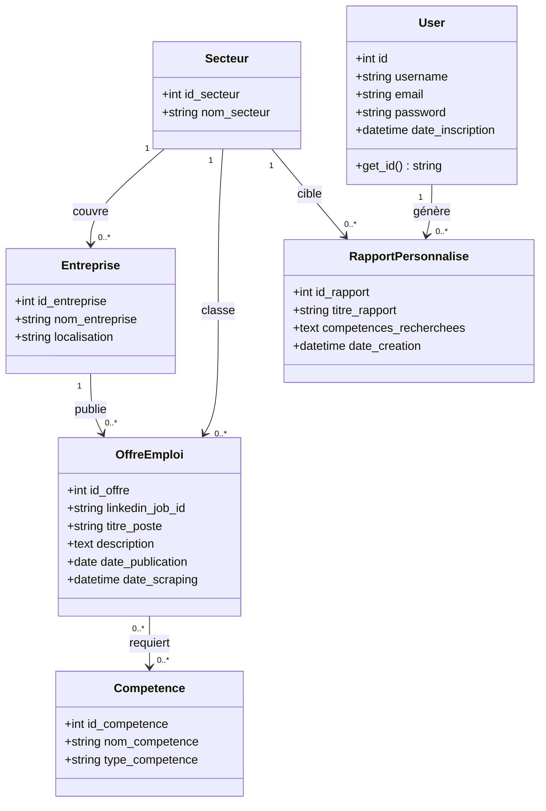
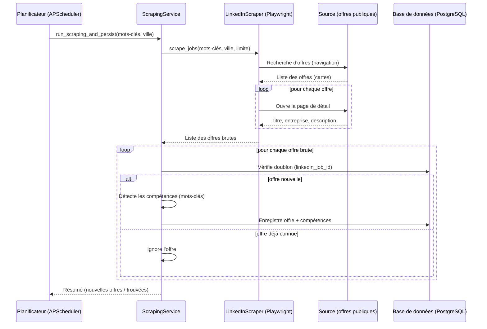
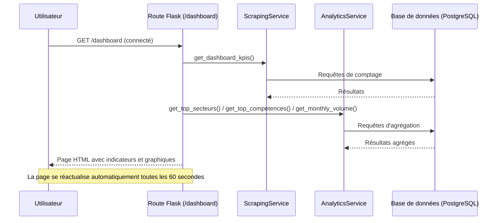
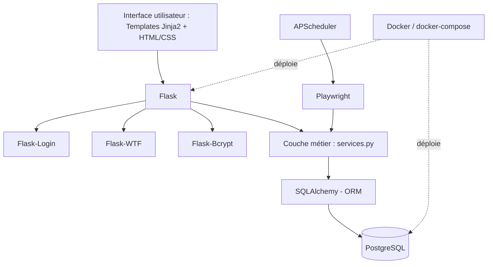

# Rapport de projet tutoré — Guide Universitaire

**Plateforme d'analyse automatisée des tendances de recrutement et des compétences demandées**

---

## 1. Introduction

### 1.1 Contexte du projet

Le projet s'inscrit dans le domaine de l'**analyse de données appliquée au marché de l'emploi**. Il combine trois volets techniques : la collecte automatisée de données publiques (web scraping), leur structuration en base de données relationnelle, et leur restitution sous forme d'indicateurs et de visualisations statistiques à destination d'un public non technique (étudiants, jeunes diplômés).

Il ne s'agit pas d'un projet de machine learning prédictif : l'« analyse » ici est une analyse **descriptive et statistique** (comptages, répartitions, évolutions temporelles, détection de mots-clés), choix justifié en section 4.

### 1.2 Problématique à résoudre

Un étudiant qui cherche à s'orienter professionnellement n'a généralement pas de vision claire, à jour et chiffrée du marché de l'emploi : quels secteurs recrutent, quelles compétences reviennent le plus souvent dans les offres, comment ces tendances évoluent dans le temps et selon la localisation. Construire cette vision manuellement (lecture d'offres une à une) est long, non reproductible et vite obsolète.

**Problématique retenue** : comment collecter, structurer et restituer automatiquement une information de marché de l'emploi fiable et à jour, sans exiger de l'utilisateur final la moindre compétence technique ni la moindre action manuelle de collecte ?

### 1.3 Objectifs du projet

- Collecter automatiquement, selon un calendrier fixe, des offres d'emploi réelles sur plusieurs secteurs et localisations.
- Structurer ces données (entreprise, secteur, compétences, localisation, date) dans une base relationnelle.
- Restituer ces données sous forme de tableaux de bord et graphiques compréhensibles en quelques minutes par un utilisateur non technique.
- Garantir que l'utilisateur n'a **jamais** à déclencher lui-même une collecte : l'information doit être disponible et à jour dès la connexion.

**Impact attendu** : une meilleure prise de décision d'orientation professionnelle, appuyée sur des données réelles et actualisées plutôt que sur des impressions.

### 1.4 Description de la plateforme et des outils utilisés

| Outil / Plateforme | Usage |
|---|---|
| **Flask** (Python) | Framework web applicatif |
| **PostgreSQL** + SQLAlchemy (ORM) | Stockage et modélisation relationnelle des données collectées |
| **Playwright** | Automatisation de navigateur pour la collecte des offres d'emploi publiques |
| **APScheduler** | Planification de la collecte automatique (tâche de fond, cron hebdomadaire) |
| **Flask-Login / Flask-Bcrypt / Flask-WTF** | Authentification, hachage des mots de passe, protection CSRF |
| **Docker / docker-compose** | Conteneurisation et déploiement reproductible |

---

## 2. Analyse des besoins

### 2.1 Description des données collectées

- **Origine** : offres d'emploi publiques extraites par scraping automatisé (recherche publique, sans compte ni connexion).
- **Type** : données semi-structurées à l'origine (pages web HTML), transformées en données structurées lors de la collecte : titre du poste, entreprise, localisation, description textuelle complète, date de collecte, identifiant unique de l'offre.
- **Volume actuel** (état de la base locale au moment du rapport) : **29 offres d'emploi**, réparties sur **24 entreprises** et **6 secteurs**, avec **8 compétences distinctes détectées**. Ce volume grandit en continu, la collecte automatique s'exécutant chaque semaine.
- Les données ne constituent pas un jeu de données « big data » : le volume est volontairement maîtrisé (quelques offres par recherche planifiée) pour rester respectueux de la source et éviter tout blocage anti-robot.

### 2.2 Analyse des utilisateurs cibles et de leurs besoins

- **Bénéficiaires principaux** : étudiants et jeunes diplômés en recherche d'orientation professionnelle.
- **Besoins identifiés** :
  - Savoir quels secteurs et compétences sont actuellement les plus demandés.
  - Visualiser une tendance dans le temps (évolution mensuelle, croissance sectorielle) plutôt qu'une photo figée.
  - Pouvoir filtrer par secteur ou localisation géographique pertinente pour eux (le projet priorise notamment les recherches sur le Burkina Faso, voir 2.3).
  - Ne nécessiter aucune compétence technique ni configuration : consultation passive uniquement.

### 2.3 Étude de marché et concurrence

Des solutions comparables existent mais ne répondent pas au besoin identifié :
- **LinkedIn Talent Insights** et **Indeed Hiring Lab** : outils d'analyse de marché de l'emploi, mais orientés entreprises/recruteurs, payants, et non focalisés sur un public étudiant francophone ou une zone géographique spécifique.
- **Statistiques publiques** (France Travail, INSEE) : fiables mais peu granulaires en temps réel et non centrées sur les compétences demandées.

**Positionnement du projet** : un outil gratuit, simple, entièrement automatisé et personnalisable dans sa zone de collecte (la rotation des recherches peut être orientée vers n'importe quelle zone géographique, ici le Burkina Faso, sans changer le code), pensé pour un usage étudiant plutôt qu'entreprise.

---

## 3. Préparation et exploration des données

### 3.1 Pré-traitement des données

- **Déduplication** : chaque offre possède un identifiant unique d'origine ; toute offre déjà connue est ignorée lors d'une nouvelle collecte.
- **Gestion des valeurs manquantes** : si la description détaillée d'une offre ne peut être chargée, le champ est renseigné avec une valeur explicite (« Description non disponible ») plutôt que laissé vide ou nul.
- **Normalisation** : le secteur d'activité d'une offre est dérivé et normalisé à partir du mot-clé de recherche (mise en forme homogène), ce qui évite la prolifération de secteurs quasi identiques mal orthographiés.

### 3.2 Exploration des données

L'exploration est réalisée en continu via les tableaux de bord de l'application plutôt que via un notebook d'analyse ponctuel :
- Distribution des offres par secteur et par entreprise.
- Distribution géographique (répartition par ville/pays).
- Distribution temporelle (volume mensuel sur une fenêtre de 2 ans).
- Détection des valeurs aberrantes opérationnelles (ex. recherches ne renvoyant aucun résultat, signalées dans les journaux de collecte plutôt que masquées).

### 3.3 Feature engineering

- **Détection de compétences** : la description textuelle brute de chaque offre est analysée à l'aide d'un dictionnaire de compétences de référence (ex. Python, SQL, Docker, Anglais, Communication) ; chaque compétence identifiée devient une variable catégorielle structurée, associée à l'offre via une table d'association.
- **Variables dérivées pour la visualisation** : pourcentage relatif de chaque secteur/compétence par rapport au maximum observé (pour dimensionner les barres), taux de croissance sur 30 jours glissants (comparaison à la période précédente).
- **Sélection des variables retenues pour l'affichage** : les indicateurs les plus discriminants ont été retenus (top 5 secteurs, top 10 compétences, 5 dernières offres) plutôt que d'exposer l'intégralité des données brutes sur le tableau de bord, pour rester lisible « en quelques minutes ».

---

## 4. Conception et modélisation

### 4.1 Choix des techniques d'analyse

Ce projet n'utilise **pas d'algorithme de machine learning supervisé**. Ce choix est justifié par le contexte :
- Aucun jeu de données labellisé n'est disponible pour entraîner un classifieur de compétences ou de secteurs.
- Le besoin exprimé est descriptif (« que se passe-t-il sur le marché ? ») et non prédictif (« que va-t-il se passer ? »).
- Une approche explicable était préférée à un modèle « boîte noire », pour un public non technique.

**Techniques retenues** :
- **Détection par règles** (correspondance de mots-clés dans un dictionnaire de compétences) pour transformer du texte libre en variables structurées.
- **Agrégations statistiques SQL** (comptages, group by, pourcentages, comparaison de fenêtres temporelles) pour produire les indicateurs de tendance.

**Alternative envisagée et non retenue à ce stade** : une analyse sémantique par NLP (traitement du langage naturel) permettrait une détection de compétences plus fine que la simple recherche de mots-clés (ex. reconnaître des synonymes ou des tournures non prévues dans le dictionnaire) ; elle est identifiée comme perspective d'évolution (section 10).

### 4.2 Architecture du système d'analyse

```
 [Planificateur automatique]  →  [Collecte des offres]  →  [Détection & structuration]  →  [Stockage]  →  [Agrégation & visualisation]
   APScheduler, cron               Playwright, recherche      Dictionnaire de mots-clés     PostgreSQL     Requêtes SQL agrégées,
   hebdomadaire, sans               par mots-clés/ville,        → compétences structurées                   restituées sur les
   action utilisateur               dédoublonnage                                                            tableaux de bord
```

Ce flux s'exécute de bout en bout sans intervention humaine, du déclenchement planifié jusqu'à l'actualisation automatique de l'affichage (rafraîchissement des pages toutes les 60 à 120 secondes).

### 4.3 Modélisation de la base de données — diagramme de classes



| Table | Rôle |
|---|---|
| `secteur` | Domaine d'activité (ex. Informatique, Data analyst) |
| `entreprise` | Société recruteuse, rattachée à un secteur et une localisation |
| `offre_emploi` | Une offre collectée (titre, description, date, identifiant source) |
| `competence` | Compétence technique ou humaine détectée |
| `offre_competence` | Table d'association many-to-many entre offres et compétences |
| `user` | Compte utilisateur de l'application |
| `rapport_personnalise` | Rapport de compétences généré par un utilisateur pour un secteur donné |

### 4.4 Diagramme de cas d'utilisation


Le second acteur, **Planificateur automatique**, matérialise le fait que la collecte n'est jamais déclenchée par l'utilisateur humain : c'est un acteur système à part entière, conformément à l'objectif du projet (section 1.3).

### 4.5 Diagramme de séquence

**Collecte automatique planifiée** (scénario central du projet) :



**Consultation du dashboard par l'utilisateur** :



### 4.6 Diagramme des technologies utilisées



Ce schéma complète le tableau des outils présenté en 1.4 en montrant comment ils s'articulent entre eux : la couche de présentation (Flask + Jinja2) s'appuie sur la couche métier, elle-même alimentée soit par une requête utilisateur (lecture via SQLAlchemy/PostgreSQL), soit par le pipeline de collecte automatisée (APScheduler déclenchant Playwright), le tout packagé et déployé via Docker.

---

## 5. Implémentation

### 5.1 Étapes de développement

Le développement s'est déroulé de façon incrémentale :
1. Modélisation des données et couche de persistance (SQLAlchemy).
2. Couche de services métier (comptes utilisateurs, collecte, analyses statistiques), strictement séparée des routes HTTP.
3. Premier moteur de collecte (Selenium), puis **migration vers Playwright** après identification de limites de fiabilité (détaillé en section 7).
4. Suppression de toute action manuelle de déclenchement de collecte côté utilisateur, remplacée par un planificateur automatique en tâche de fond.
5. Paramétrage de la rotation des recherches automatiques pour prioriser une zone géographique donnée (Burkina Faso).
6. Harmonisation visuelle des classements (code couleur par rang) sur l'ensemble des graphiques.

### 5.2 Présentation des modèles et algorithmes développés

- **Algorithme de détection de compétences** : pour chaque compétence de référence, une liste de mots-clés associés est recherchée (insensible à la casse) dans la description de l'offre ; toute correspondance ajoute la compétence à l'offre.
- **Algorithme de calcul de croissance sectorielle** : comparaison, pour chaque secteur, du nombre d'offres des 30 derniers jours à celui des 30 jours précédents, avec un taux de variation en pourcentage.
- **Algorithme de répartition en anneau (donut)** : conversion des parts relatives de chaque secteur en segments d'un tracé SVG (longueur d'arc proportionnelle à la circonférence).

### 5.3 Paramètres de fonctionnement (équivalents des hyperparamètres)

Le système n'ayant pas de modèle entraîné, les « paramètres » ajustables sont opérationnels plutôt que statistiques :

| Paramètre | Valeur par défaut | Rôle |
|---|---|---|
| Jours de collecte | Lundi, mercredi, vendredi | Répartition de la charge dans la semaine |
| Heure de collecte | 2h00 | Créneau à faible trafic |
| Nombre d'offres par collecte | 10 | Volume par exécution planifiée |
| Liste de recherches (rotation) | 7 recherches Burkina Faso / 3 hors zone | Priorisation géographique |

### 5.4 Description des modules et composants clés

| Fichier | Responsabilité |
|---|---|
| `routes.py` | Points d'entrée HTTP uniquement, aucune logique métier |
| `services.py` | Logique métier : comptes utilisateurs, collecte, agrégations statistiques |
| `models.py` | Structure des données (ORM) |
| `scraping/scraper.py` | Moteur de collecte (Playwright) |
| `scheduler.py` | Orchestration de la collecte automatique planifiée |

---

## 6. Résultats de l'analyse

### 6.1 Résultats et interprétation

Sur l'état actuel de la base (29 offres) :
- Le secteur **Développeur informatique** domine en volume (10 offres), suivi de Data analyst, Chef de projet marketing, Développeur Python et Ingénieur génie civil.
- Les compétences les plus fréquemment détectées sont **Communication** (21 mentions), **Anglais** (14) et **Python** (11), avec une répartition quasi équilibrée entre compétences techniques (49 %) et humaines (51 %).
- La répartition géographique confirme la priorisation attendue : Paris (7 offres) et un ensemble de localisations au Burkina Faso (Ouagadougou, Bobo-Dioulasso — 13 offres cumulées) forment les deux pôles principaux.

Ces résultats ne s'évaluent pas avec des métriques de classification (précision, rappel, F1-score), puisqu'il n'y a pas de modèle prédictif à valider ; l'indicateur de qualité pertinent ici est la **cohérence des données restituées** avec les offres réellement publiées, vérifiée manuellement lors des tests (section 7).

### 6.2 Visualisation des résultats

**Dashboard** — vue d'ensemble avec indicateurs clés, répartition par secteur et compétences les plus recherchées :


**Offres d'emploi** — liste complète des offres réelles collectées, filtrable par mot-clé, secteur et localisation :


**Compétences** — classement des compétences les plus demandées et répartition technique / humaine :


**Tendances** — répartition sectorielle, volume mensuel, répartition géographique et secteurs en forte croissance :


**Rapports personnalisés** — génération de rapports de compétences ciblés par secteur :


### 6.3 Comparaison de deux versions du moteur de collecte

Le projet permet une comparaison concrète entre deux versions du moteur de collecte, à recherche identique :

| Moteur | Offres extraites avec succès | Champs correctement renseignés |
|---|---|---|
| Selenium (version initiale) | 1 / 3 | Titre, entreprise, localisation vides sur 2 offres/3 |
| Playwright (version actuelle) | 3 / 3 | Tous les champs correctement renseignés |

---

## 7. Tests et validation

### 7.1 Description des méthodes de validation

Le projet ne comportant pas de modèle prédictif, aucune validation croisée ni découpage train/test n'est applicable. La validation retenue est de nature **fonctionnelle et de bout en bout** :
- Exécution réelle de la collecte contre la source publique, à chaque évolution du moteur de scraping.
- Vérification directe en base de données (comptages, contrôle des associations offre/compétence) après chaque collecte de test.
- Tests de rendu des pages (statuts HTTP, présence des données attendues) après chaque modification de template.

### 7.2 Résultats des tests et analyse des erreurs

Trois anomalies distinctes ont été identifiées et corrigées durant le projet :

1. **Identifiant d'offre introuvable** : la source avait déplacé l'attribut d'identification d'un niveau dans la structure de la page ; toutes les offres étaient silencieusement ignorées. *Correction* : lecture de l'attribut au bon niveau.
2. **Champs vides malgré un identifiant valide** : après défilement de la page pour charger davantage d'offres, les premières cartes se retrouvaient hors de la zone visible, et le texte n'était plus accessible. *Correction* : replacement explicite de chaque carte dans la zone visible avant lecture.
3. **Timeouts réseau intermittents** : lors de collectes rapprochées, certaines requêtes vers la source échouent par blocage temporaire (comportement anti-robot classique). *Analyse* : erreurs gérées sans interrompre le reste de la collecte (l'offre en échec est simplement ignorée, la collecte continue).

**Propositions d'amélioration** : espacement accru entre les requêtes, ou migration à terme vers une API officielle d'offres d'emploi (voir section 10), moins sujette à ce type de blocage.

---

## 8. Performances et optimisation

### 8.1 Évaluation des performances

- La migration Selenium → Playwright a fait passer le taux de succès d'extraction de 1/3 à 3/3 sur un test comparable (voir 6.3), grâce à un mécanisme d'attente automatique plus robuste face aux pages dynamiques.
- La collecte planifiée (plutôt qu'à la demande) répartit la charge réseau dans le temps et réduit le risque de blocage par la source.

### 8.2 Optimisation mise en œuvre

- Ajustement de la taille de fenêtre du navigateur automatisé pour garantir un rendu de page complet (évite les champs vides liés à un affichage mobile involontaire).
- Repositionnement explicite de chaque élément avant lecture de son contenu (évite les échecs liés au défilement de page).
- Rotation des recherches automatiques pour ne jamais solliciter la même requête deux fois de suite, réduisant la probabilité de blocage.

---

## 9. Sécurité et protection des données

### 9.1 Mesures de sécurité des données

- Mots de passe **jamais stockés en clair** : hachage Bcrypt à salage automatique.
- Protection **CSRF** sur l'ensemble des formulaires (Flask-WTF).
- Variables sensibles (clé secrète d'application, identifiants de base de données) externalisées dans un fichier d'environnement non versionné.
- Accès à l'ensemble des pages d'analyse protégé par authentification obligatoire.

### 9.2 Gestion des données personnelles

Les seules données à caractère personnel traitées par l'application concernent les comptes utilisateurs de la plateforme elle-même (nom d'utilisateur, email, mot de passe haché) — aucune donnée personnelle de tiers (candidats, recruteurs individuels) n'est collectée : les offres d'emploi extraites sont des informations publiques publiées par des entreprises. Une revue de conformité RGPD serait néanmoins recommandée avant tout passage à une échelle de production plus large (voir section 10).

---

## 10. Conclusion

### 10.1 Résumé des réalisations

Le projet a permis de mettre en place une chaîne complète, automatisée et fonctionnelle : collecte planifiée d'offres d'emploi réelles, structuration en base relationnelle, détection de compétences, et restitution visuelle actualisée en continu — sans jamais exiger d'action manuelle de l'utilisateur final. Les objectifs fixés en introduction sont atteints et vérifiés sur données réelles (29 offres collectées, 6 secteurs, 8 compétences détectées).

### 10.2 Perspectives d'amélioration

- Remplacer la détection de compétences par mots-clés par une approche NLP plus fine (synonymes, variantes non prévues).
- Espacer davantage les requêtes de collecte pour réduire le taux d'échec observé lors de sollicitations rapprochées.

### 10.3 Développement futur

- Migration à terme vers une **API officielle d'offres d'emploi** (ex. France Travail, Adzuna), moins fragile qu'une extraction de page web et mieux adaptée à un passage à l'échelle.
- Extension de la priorisation géographique à d'autres zones, et ajout de comparatifs multi-pays sur les mêmes tableaux de bord.

---

## 11. Annexes

### 11.1 Diagrammes et visualisations complémentaires

Les captures d'écran complètes de l'application (section 6.2) sont disponibles dans `docs/screenshots/` : `dashboard.png`, `offres.png`, `competences.png`, `tendances.png`, `rapports.png`.

### 11.2 Extraits de code source

**Détection de compétences par mots-clés** (`app/services.py`) :
```python
for skill_name, keywords_list in self.skills_dictionary.items():
    if any(kw in description_lower for kw in keywords_list):
        competence = Competence.query.filter_by(nom_competence=skill_name).first()
        if not competence:
            competence = Competence(nom_competence=skill_name, ...)
            db.session.add(competence)
        new_job.competences.append(competence)
```

**Planification hebdomadaire de la collecte** (`app/scheduler.py`) :
```python
_scheduler.add_job(
    func=lambda: _run_next_auto_collect(app, scraping_service, limit),
    trigger=CronTrigger(day_of_week=days, hour=hour, minute=minute),
    id="auto_scraping_job",
    replace_existing=True,
)
```

### 11.3 Documentation des algorithmes

**Calcul du taux de croissance sectorielle** :
```
croissance (%) = (offres_30_derniers_jours − offres_30_jours_précédents) / offres_30_jours_précédents × 100
```

**Dictionnaire de compétences de référence** : chaque compétence (ex. « Python », « SQL », « Communication ») est associée à une liste de mots-clés recherchés dans le texte de l'offre (insensible à la casse), permettant une détection simple et explicable, sans modèle statistique entraîné.
