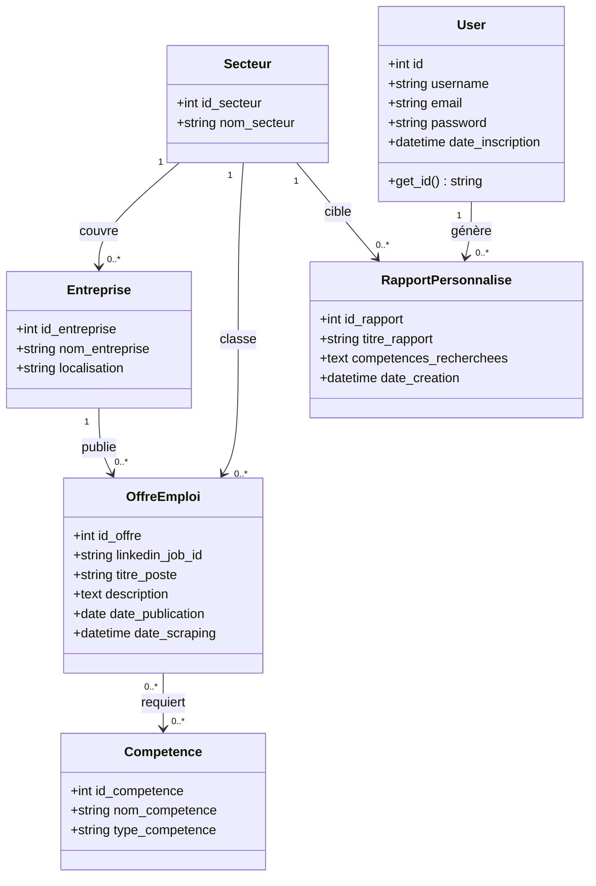
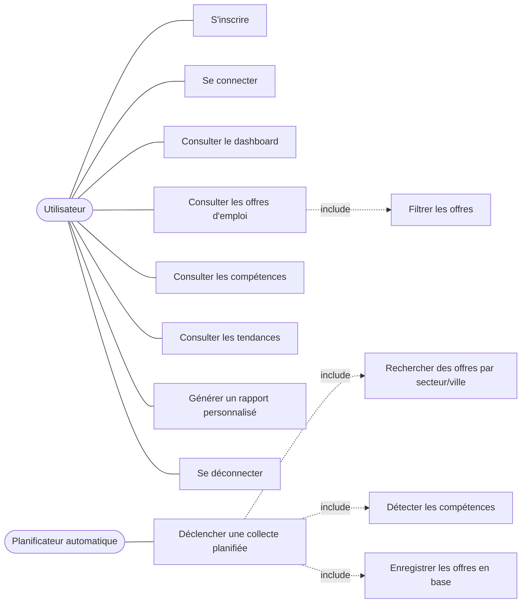
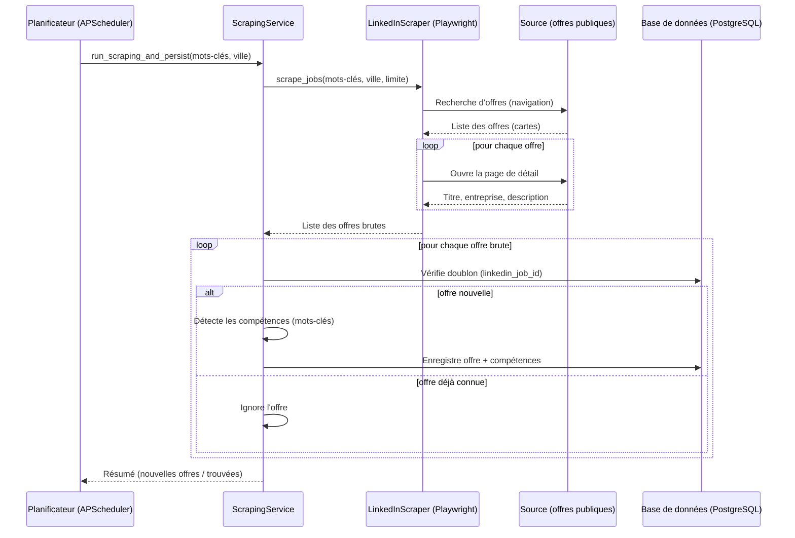
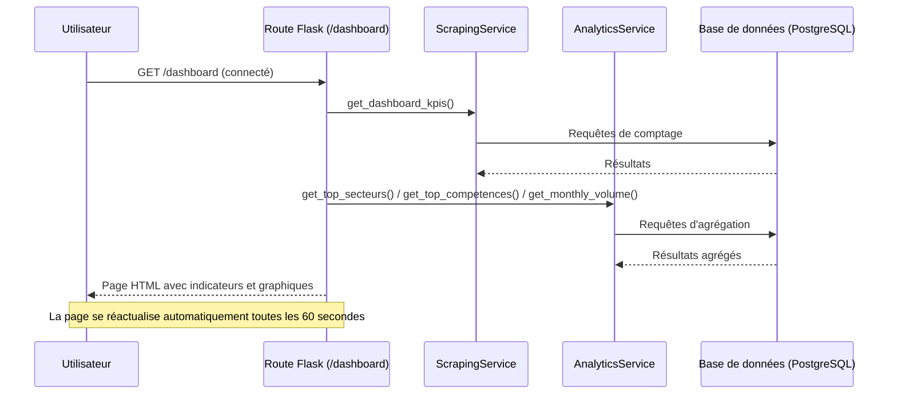
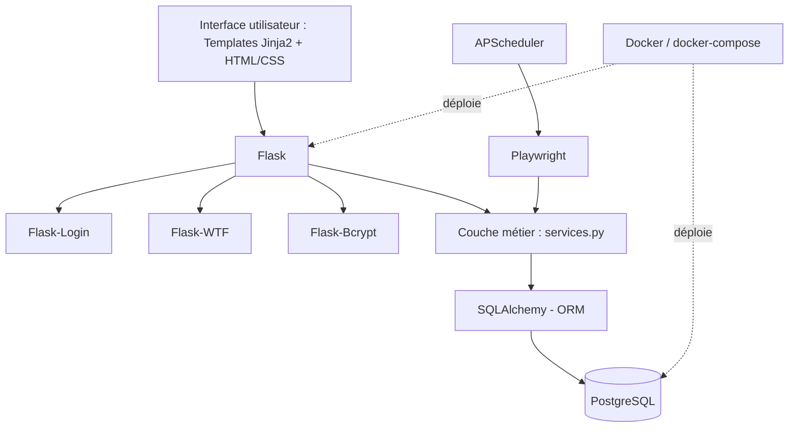
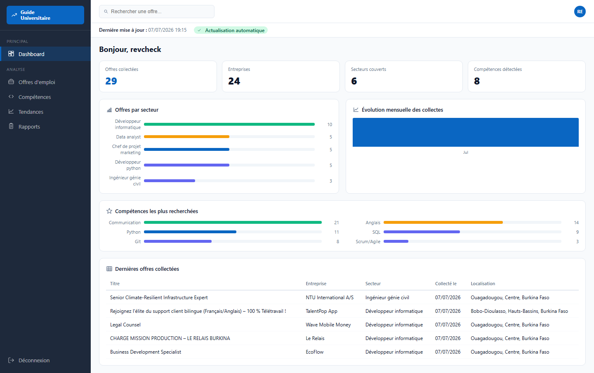
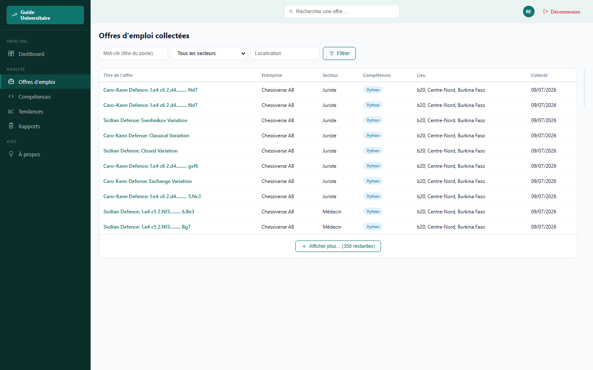
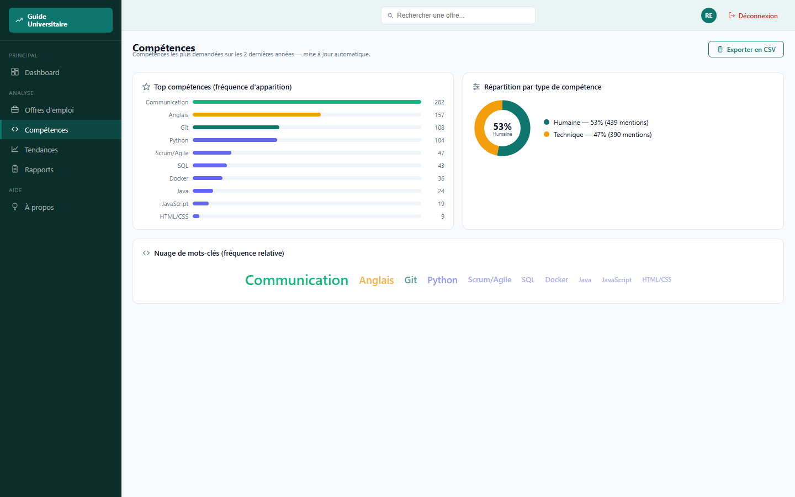
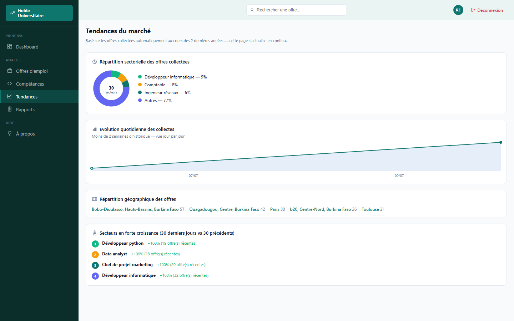
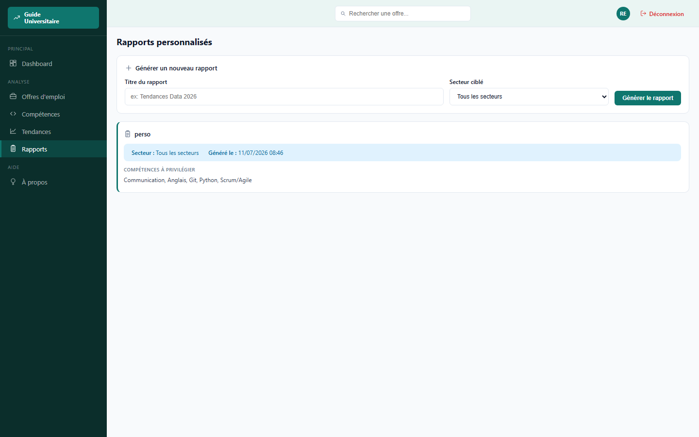

# Rapport de projet tutoré — Guide Universitaire

**Plateforme d'analyse automatisée des tendances de recrutement et des compétences demandées**

---

## 1. Introduction

### 1.1 Contexte du projet

Le projet s'inscrit dans le domaine de l'**analyse de données appliquée au marché de l'emploi**. Il combine trois volets techniques : la collecte automatisée de données publiques (web scraping), leur structuration en base de données relationnelle, et leur restitution sous forme d'indicateurs et de visualisations statistiques à destination d'un public non technique (étudiants, jeunes diplômés).

Il ne s'agit pas d'un projet de machine learning prédictif : l'« analyse » ici est une analyse **descriptive et statistique** (comptages, répartitions, évolutions temporelles, détection de mots-clés), choix justifié en section 4.

### 1.2 Problématique à résoudre

Un étudiant qui cherche à s'orienter professionnellement n'a généralement pas de vision claire, à jour et chiffrée du marché de l'emploi : quels secteurs recrutent, quelles compétences reviennent le plus souvent dans les offres, comment ces tendances évoluent dans le temps et selon la localisation. Construire cette vision manuellement (lecture d'offres une à une) est long, non reproductible et vite obsolète.

**Problématique retenue** : comment collecter, structurer et restituer automatiquement une information de marché de l'emploi fiable et à jour, sans exiger de l'utilisateur final la moindre compétence technique ni la moindre action manuelle de collecte ?

### 1.3 Objectifs du projet

- Collecter automatiquement, selon un calendrier fixe, des offres d'emploi réelles sur plusieurs secteurs et localisations.
- Structurer ces données (entreprise, secteur, compétences, localisation, date) dans une base relationnelle.
- Restituer ces données sous forme de tableaux de bord et graphiques compréhensibles en quelques minutes par un utilisateur non technique.
- Garantir que l'utilisateur n'a **jamais** à déclencher lui-même une collecte : l'information doit être disponible et à jour dès la connexion.

**Impact attendu** : une meilleure prise de décision d'orientation professionnelle, appuyée sur des données réelles et actualisées plutôt que sur des impressions.

### 1.4 Description de la plateforme et des outils utilisés

Toutes les bibliothèques ci-dessous sont déclarées avec leur version exacte dans `requirements.txt` (sauf la section « Pipeline NLP », ajoutée récemment avec des bornes minimales pour garantir la disponibilité de paquets précompilés sur les environnements récents).

**Cœur applicatif**

| Bibliothèque | Version | Usage |
|---|---|---|
| Flask | 3.0.3 | Framework web applicatif : routage, gabarits Jinja2, gestion des requêtes HTTP |
| Flask-SQLAlchemy | 3.1.1 | Intégration de l'ORM SQLAlchemy dans Flask (modèles, sessions, requêtes) |
| psycopg2-binary | 2.9.12 | Pilote de connexion PostgreSQL utilisé par SQLAlchemy |
| python-dotenv | 1.0.1 | Chargement des variables d'environnement depuis le fichier `.env` |
| gunicorn | 22.0.0 | Serveur WSGI de production, utilisé dans le conteneur Docker |

**Authentification, comptes et sécurité**

| Bibliothèque | Version | Usage |
|---|---|---|
| Flask-Login | 0.6.3 | Gestion de la session utilisateur connecté (`login_user`, `@login_required`) |
| Flask-Bcrypt | 1.0.1 | Hachage irréversible et salé des mots de passe |
| Flask-WTF | 1.2.1 | Formulaires web avec protection CSRF intégrée |
| email-validator | 2.1.1 | Validation du format des adresses e-mail dans les formulaires |
| itsdangerous | (dépendance de Flask) | Génération et vérification de jetons signés et horodatés, utilisés pour les liens de réinitialisation de mot de passe |
| Flask-Mail | 0.10.0 | Envoi des e-mails de réinitialisation de mot de passe (avec repli console si aucun compte SMTP n'est configuré) |
| Flask-Migrate | 4.0.7 | Migrations de schéma de base de données ; installée dans le projet, mais les évolutions de schéma effectuées jusqu'ici (ajout de `onboarding_vu`, création de `profil_candidat`) l'ont été manuellement en SQL plutôt que via `flask db migrate` |

**Collecte automatisée des données**

| Bibliothèque | Version | Usage |
|---|---|---|
| Playwright | 1.61.0 | Automatisation de navigateur headless pour la collecte des offres d'emploi publiques (LinkedIn, page dynamique) |
| requests | 2.34.2 | Requêtes HTTP simples, utilisées par les sources ne nécessitant pas de navigateur (Emploi LeFaso.net, ICI Partenaires Entreprises) |
| beautifulsoup4 | 4.12.3 | Extraction du contenu HTML des sites Emploi LeFaso.net et ICI Partenaires Entreprises (pages rendues côté serveur/JSON, sans navigateur) |
| APScheduler | 3.10.4 | Planification de la collecte automatique en tâche de fond (cron hebdomadaire) |

**Pipeline NLP** (chantier en cours d'intégration, détaillé en 5.6)

| Bibliothèque | Version | Usage |
|---|---|---|
| spaCy | ≥ 3.8.4 | Squelette du pipeline d'analyse de texte : tokenisation et orchestration des composants personnalisés |
| transformers (Hugging Face) | ≥ 4.46.0 | Chargement et inférence des modèles CamemBERT (NER et classification de texte) |
| torch (PyTorch) | ≥ 2.5.0 | Moteur de calcul (CPU ou GPU) exécutant les modèles CamemBERT |
| sentencepiece | ≥ 0.2.0 | Tokenizer requis par CamemBERT (dépendance de `transformers`) |
| protobuf | ≥ 5.28.0 | Format de sérialisation requis par le tokenizer CamemBERT |

*Note technique : les versions de spaCy/transformers/torch ont été choisies (plutôt que des versions plus anciennes, initialement pressenties) pour disposer de « wheels » Python précompilées sous Python 3.13 — une version fixée trop ancienne de spaCy tente de recompiler sa dépendance `blis` depuis les sources et échoue sous Windows en l'absence d'un compilateur C configuré.*

**Conteneurisation**

| Outil | Usage |
|---|---|
| Docker / docker-compose | Conteneurisation et déploiement reproductible : service `web` (application Flask + Playwright/Chromium) et service `db` (PostgreSQL 15) |

**Conception et entraînement (outils externes, hors dépendances Python)**

| Outil | Usage |
|---|---|
| Google Colab | Exécution du notebook `app/nlp/entrainement_colab.ipynb` (section 5.6) : entraînement des données et fine-tuning des modèles CamemBERT avec accélération GPU, sans installation locale |
| StarUML | Modélisation conceptuelle du système (diagramme de classes, diagramme de cas d'utilisation, diagramme de séquence) en amont de leur retranscription au format Mermaid dans ce rapport (section 4) |

### 1.5 Structure et hiérarchie des fichiers du projet

```
guideUniversitaire/
├── app/                                  # Package applicatif principal
│   ├── __init__.py                       # Fabrique d'application (create_app), initialisation des extensions Flask
│   ├── routes.py                         # Contrôleurs HTTP (Blueprint "main") — aucune logique métier
│   ├── services.py                       # Couche métier : UserService, ScrapingService, AnalyticsService
│   ├── models.py                         # Modèles SQLAlchemy (tables de la base PostgreSQL)
│   ├── forms.py                          # Formulaires WTForms et leurs règles de validation
│   ├── scheduler.py                      # Planification de la collecte automatique (APScheduler)
│   ├── scraping/
│   │   └── scraper.py                    # Moteur de collecte (Playwright)
│   ├── nlp/                              # Pipeline NLP hybride — chantier en cours, voir 5.6
│   │   ├── __init__.py
│   │   ├── job_analyzer.py               # JobAnalyzerPipeline : architecture cible (spaCy + 2 CamemBERT fine-tunés)
│   │   ├── demo_pipeline_generique.py    # Démonstration exécutable du pipeline avec des modèles publics
│   │   ├── collecte_corpus.py            # Script local : collecte le corpus d'entraînement (sans GPU, sans Colab)
│   │   └── entrainement_colab.ipynb      # Notebook Google Colab pour entraîner les deux modèles CamemBERT
│   ├── static/
│   │   └── css/style.css                 # Feuille de style unique de l'application
│   └── templates/                        # Gabarits Jinja2
│       ├── base.html                     # Structure commune (barre latérale, en-tête, bandeau visiteur)
│       ├── auth_base.html                # Structure commune aux pages d'authentification
│       ├── _icons.html                   # Macro Jinja2 centralisant les icônes SVG
│       ├── dashboard.html                # Tableau de bord (indicateurs, graphiques, animation d'entrée)
│       ├── offres.html                   # Liste des offres, filtres, pagination
│       ├── competences.html              # Classement des compétences, donut, nuage de mots-clés
│       ├── tendances.html                # Répartition sectorielle, évolution, géographie, croissance
│       ├── rapports.html                 # Génération de rapports personnalisés
│       ├── about.html                    # Page « À propos »
│       ├── login.html / register.html    # Connexion / inscription
│       ├── bienvenue.html                # Invitation facultative à compléter son profil
│       └── forgot_password.html / reset_password.html   # Réinitialisation de mot de passe
├── docs/
│   └── screenshots/                      # Captures d'écran utilisées dans ce rapport (section 6.2)
├── config.py                             # Configuration centralisée (lecture des variables d'environnement)
├── run.py                                # Point d'entrée de l'application (lancement local)
├── requirements.txt                      # Dépendances Python du projet (détaillées en 1.4)
├── Dockerfile                            # Image Docker de l'application web
├── docker-compose.yml                    # Orchestration des services web + base de données
├── .env                                  # Secrets et configuration locale (non versionné)
├── RAPPORT_PROJET.md                     # Ce rapport
└── Guide_Universitaire_Presentation.pptx # Support de présentation
```

Cette organisation matérialise la séparation en couches appliquée dans tout le projet : présentation (`templates/`, `static/`), contrôleurs (`routes.py`), logique métier (`services.py`), accès aux données (`models.py`), et deux sous-systèmes indépendants pouvant évoluer sans toucher au reste de l'application — la collecte (`scraping/`, `scheduler.py`) et l'analyse de texte (`nlp/`).

---

## 2. Analyse des besoins

### 2.1 Description des données collectées

- **Origine** : offres d'emploi publiques extraites par scraping automatisé (recherche publique, sans compte ni connexion).
- **Type** : données semi-structurées à l'origine (pages web HTML), transformées en données structurées lors de la collecte : titre du poste, entreprise, localisation, description textuelle complète, date de collecte, identifiant unique de l'offre.
- **Volume actuel** (état de la base au moment de cette mise à jour du rapport) : **360 offres d'emploi**, réparties sur **193 entreprises** et **30 secteurs**, avec **10 compétences distinctes détectées**. Ce volume grandit en continu, la collecte automatique s'exécutant chaque semaine (ce compteur est passé de 29 à 360 offres au fil des collectes exceptionnelles et automatiques successives décrites en 5.5).
- Les données ne constituent pas un jeu de données « big data » : le volume est volontairement maîtrisé (quelques offres par recherche planifiée) pour rester respectueux de la source et éviter tout blocage anti-robot.

### 2.2 Analyse des utilisateurs cibles et de leurs besoins

- **Bénéficiaires principaux** : étudiants et jeunes diplômés en recherche d'orientation professionnelle.
- **Besoins identifiés** :
  - Savoir quels secteurs et compétences sont actuellement les plus demandés.
  - Visualiser une tendance dans le temps (évolution mensuelle, croissance sectorielle) plutôt qu'une photo figée.
  - Pouvoir filtrer par secteur ou localisation géographique pertinente pour eux (le projet priorise notamment les recherches sur le Burkina Faso, voir 2.3).
  - Ne nécessiter aucune compétence technique ni configuration : consultation passive uniquement.

### 2.3 Étude de marché et concurrence

Des solutions comparables existent mais ne répondent pas au besoin identifié :
- **LinkedIn Talent Insights** et **Indeed Hiring Lab** : outils d'analyse de marché de l'emploi, mais orientés entreprises/recruteurs, payants, et non focalisés sur un public étudiant francophone ou une zone géographique spécifique.
- **Burning Glass Technologies** (fondée en 1999, aujourd'hui intégrée à Lightcast) : pionnier de l'analyse temps réel des offres d'emploi et du matching CV/poste par IA à grande échelle ; solution mature et éprouvée, mais destinée aux entreprises, recruteurs et institutions (analyse de marché du travail à des fins de planification RH ou de politique publique), payante, et sans déclinaison pensée pour l'auto-orientation d'un étudiant. Deux de ses fonctionnalités phares — prévision de tendances et mesure d'un écart offre/demande — ont été reprises dans une version simplifiée et explicable (section 5.7) ; le matching CV/poste et le benchmarking salarial restent hors périmètre, faute de collecte de CV ou de données salariales.
- **Statistiques publiques** (France Travail, INSEE) : fiables mais peu granulaires en temps réel et non centrées sur les compétences demandées.

**Positionnement du projet** : un outil gratuit, simple, entièrement automatisé et personnalisable dans sa zone de collecte (la rotation des recherches peut être orientée vers n'importe quelle zone géographique, ici le Burkina Faso, sans changer le code), pensé pour un usage étudiant plutôt qu'entreprise.

---

## 3. Préparation et exploration des données

### 3.1 Pré-traitement des données

- **Déduplication** : chaque offre possède un identifiant unique d'origine ; toute offre déjà connue est ignorée lors d'une nouvelle collecte.
- **Gestion des valeurs manquantes** : si la description détaillée d'une offre ne peut être chargée, le champ est renseigné avec une valeur explicite (« Description non disponible ») plutôt que laissé vide ou nul.
- **Normalisation** : le secteur d'activité d'une offre est dérivé et normalisé à partir du mot-clé de recherche (mise en forme homogène), ce qui évite la prolifération de secteurs quasi identiques mal orthographiés.

### 3.2 Exploration des données

L'exploration est réalisée en continu via les tableaux de bord de l'application plutôt que via un notebook d'analyse ponctuel :
- Distribution des offres par secteur et par entreprise.
- Distribution géographique (répartition par ville/pays).
- Distribution temporelle (volume mensuel sur une fenêtre de 2 ans).
- Détection des valeurs aberrantes opérationnelles (ex. recherches ne renvoyant aucun résultat, signalées dans les journaux de collecte plutôt que masquées).

### 3.3 Feature engineering

- **Détection de compétences** : la description textuelle brute de chaque offre est analysée à l'aide d'un dictionnaire de compétences de référence (ex. Python, SQL, Docker, Anglais, Communication) ; chaque compétence identifiée devient une variable catégorielle structurée, associée à l'offre via une table d'association.
- **Variables dérivées pour la visualisation** : pourcentage relatif de chaque secteur/compétence par rapport au maximum observé (pour dimensionner les barres), taux de croissance sur 30 jours glissants (comparaison à la période précédente).
- **Sélection des variables retenues pour l'affichage** : les indicateurs les plus discriminants ont été retenus (top 5 secteurs, top 10 compétences, 5 dernières offres) plutôt que d'exposer l'intégralité des données brutes sur le tableau de bord, pour rester lisible « en quelques minutes ».

---

## 4. Conception et modélisation

### 4.1 Choix des techniques d'analyse

Ce projet n'utilise **pas d'algorithme de machine learning supervisé**. Ce choix est justifié par le contexte :
- Aucun jeu de données labellisé n'est disponible pour entraîner un classifieur de compétences ou de secteurs.
- Le besoin exprimé est descriptif (« que se passe-t-il sur le marché ? ») et non prédictif (« que va-t-il se passer ? »).
- Une approche explicable était préférée à un modèle « boîte noire », pour un public non technique.

**Techniques retenues** :
- **Détection par règles** (correspondance de mots-clés dans un dictionnaire de compétences) pour transformer du texte libre en variables structurées.
- **Agrégations statistiques SQL** (comptages, group by, pourcentages, comparaison de fenêtres temporelles) pour produire les indicateurs de tendance.
- **Extrapolation linéaire simple** (méthode de la dérive, section 5.7) pour projeter un volume d'offres à 30 jours à partir des variations déjà observées — un premier niveau de « prévision » assumé comme statistique et explicable, pas comme un modèle de séries temporelles entraîné.

**Évolution engagée depuis la rédaction initiale de cette section** : une analyse sémantique par NLP (traitement du langage naturel), initialement identifiée comme perspective non retenue, est désormais un chantier actif — un pipeline hybride spaCy + CamemBERT a été conçu et démontré fonctionnellement (section 5.6), en réponse directe à une anomalie de cohérence des données constatée sur la version par dictionnaire de mots-clés (section 7.2, anomalie n°4). Son intégration complète en production reste conditionnée à un fine-tuning sur données annotées, non encore réalisé.

### 4.2 Architecture du système d'analyse

```
 [Planificateur automatique]  →  [Collecte des offres]  →  [Détection & structuration]  →  [Stockage]  →  [Agrégation & visualisation]
   APScheduler, cron               Playwright, recherche      Dictionnaire de mots-clés     PostgreSQL     Requêtes SQL agrégées,
   hebdomadaire, sans               par mots-clés/ville,        → compétences structurées                   restituées sur les
   action utilisateur               dédoublonnage                                                            tableaux de bord
```

Ce flux s'exécute de bout en bout sans intervention humaine, du déclenchement planifié jusqu'à l'actualisation automatique de l'affichage (rafraîchissement des pages toutes les 60 à 120 secondes).

### 4.3 Modélisation de la base de données — diagramme de classes



| Table | Rôle |
|---|---|
| `secteur` | Domaine d'activité (ex. Informatique, Data analyst) |
| `entreprise` | Société recruteuse, rattachée à un secteur et une localisation |
| `offre_emploi` | Une offre collectée (titre, description, date, identifiant source) |
| `competence` | Compétence technique ou humaine détectée |
| `offre_competence` | Table d'association many-to-many entre offres et compétences |
| `user` | Compte utilisateur de l'application |
| `rapport_personnalise` | Rapport de compétences généré par un utilisateur pour un secteur donné |

### 4.4 Diagramme de cas d'utilisation



Le second acteur, **Planificateur automatique**, matérialise le fait que la collecte n'est jamais déclenchée par l'utilisateur humain : c'est un acteur système à part entière, conformément à l'objectif du projet (section 1.3).

### 4.5 Diagramme de séquence

**Collecte automatique planifiée** (scénario central du projet) :



**Consultation du dashboard par l'utilisateur** :



### 4.6 Diagramme des technologies utilisées



Ce schéma complète le tableau des outils présenté en 1.4 en montrant comment ils s'articulent entre eux : la couche de présentation (Flask + Jinja2) s'appuie sur la couche métier, elle-même alimentée soit par une requête utilisateur (lecture via SQLAlchemy/PostgreSQL), soit par le pipeline de collecte automatisée (APScheduler déclenchant Playwright), le tout packagé et déployé via Docker.

---

## 5. Implémentation

### 5.1 Étapes de développement

Le développement s'est déroulé de façon incrémentale :
1. Modélisation des données et couche de persistance (SQLAlchemy).
2. Couche de services métier (comptes utilisateurs, collecte, analyses statistiques), strictement séparée des routes HTTP.
3. Premier moteur de collecte (Selenium), puis **migration vers Playwright** après identification de limites de fiabilité (détaillé en section 7).
4. Suppression de toute action manuelle de déclenchement de collecte côté utilisateur, remplacée par un planificateur automatique en tâche de fond.
5. Paramétrage de la rotation des recherches automatiques pour prioriser une zone géographique donnée (Burkina Faso).
6. Harmonisation visuelle des classements (code couleur par rang) sur l'ensemble des graphiques.

### 5.2 Présentation des modèles et algorithmes développés

- **Algorithme de détection de compétences** : pour chaque compétence de référence, une liste de mots-clés associés est recherchée (insensible à la casse) dans la description de l'offre ; toute correspondance ajoute la compétence à l'offre.
- **Algorithme de calcul de croissance sectorielle** : comparaison, pour chaque secteur, du nombre d'offres des 30 derniers jours à celui des 30 jours précédents, avec un taux de variation en pourcentage.
- **Algorithme de répartition en anneau (donut)** : conversion des parts relatives de chaque secteur en segments d'un tracé SVG (longueur d'arc proportionnelle à la circonférence).

### 5.3 Paramètres de fonctionnement (équivalents des hyperparamètres)

Le système n'ayant pas de modèle entraîné, les « paramètres » ajustables sont opérationnels plutôt que statistiques :

| Paramètre | Valeur par défaut | Rôle |
|---|---|---|
| Jours de collecte | Lundi, mercredi, vendredi | Répartition de la charge dans la semaine |
| Heure de collecte | 2h00 | Créneau à faible trafic |
| Nombre d'offres par collecte | 10 | Volume par exécution planifiée |
| Liste de recherches (rotation) | 7 recherches Burkina Faso / 3 hors zone | Priorisation géographique |

### 5.4 Description des modules et composants clés

| Fichier | Responsabilité |
|---|---|
| `app/__init__.py` | Fabrique d'application (`create_app`), initialisation des extensions Flask, démarrage du planificateur |
| `config.py` | Configuration centralisée : secrets, connexion base de données, paramètres de collecte et d'e-mail |
| `routes.py` | Points d'entrée HTTP uniquement, aucune logique métier |
| `services.py` | Logique métier : comptes utilisateurs, collecte, agrégations statistiques |
| `models.py` | Structure des données (ORM) |
| `forms.py` | Formulaires WTForms (inscription, connexion, profil facultatif, réinitialisation, rapports) et leurs règles de validation |
| `scraping/scraper.py` | Moteur de collecte LinkedIn (Playwright) |
| `scraping/lefaso_client.py` | Client du site public Emploi LeFaso.net (requests + BeautifulSoup) |
| `scraping/ici_pe_client.py` | Client du site public ICI Partenaires Entreprises (requests + BeautifulSoup, point d'entrée JSON du plugin WordPress WP Job Manager) |
| `scheduler.py` | Orchestration de la collecte automatique planifiée |
| `nlp/job_analyzer.py` | Pipeline NLP hybride cible (spaCy + 2 modèles CamemBERT fine-tunés), non encore branché sur `services.py` (voir 5.6) |
| `nlp/demo_pipeline_generique.py` | Démonstration exécutable du pipeline NLP avec des modèles publics génériques |
| `nlp/collecte_corpus.py` | Script local (sans GPU) qui collecte le corpus d'entraînement en réutilisant directement les clients de `scraping/`, exécuté avant l'entraînement sur Colab |
| `nlp/entrainement_colab.ipynb` | Notebook Google Colab pour entraîner (fine-tuner) les deux modèles CamemBERT ciblés |

### 5.5 Historique détaillé des évolutions apportées après la version initiale

Le tableau suivant documente, fonctionnalité par fonctionnalité, chaque modification apportée au code depuis la première version fonctionnelle du projet (collecte + dashboard de base), avec les fichiers concernés.

| Fonctionnalité | Fichiers modifiés/créés | Description |
|---|---|---|
| Migration Selenium → Playwright | `scraping/scraper.py`, `Dockerfile` | Remplacement complet du moteur de collecte après identification de deux anomalies bloquantes (détaillées en 7.2) |
| Priorisation géographique Burkina Faso | `scheduler.py` | Rotation de recherches automatiques pondérée (7 recherches Burkina Faso / 3 hors zone) |
| Accès public sans connexion | `routes.py`, `base.html` | Dashboard, Offres, Compétences, Tendances et À propos consultables sans compte ; seule la génération de rapports personnalisés reste protégée |
| Bandeau visiteur incitatif | `base.html`, `style.css` | Invitation à créer un compte affichée aux visiteurs non connectés, sans jamais bloquer la consultation |
| Connexion/déconnexion repositionnées | `base.html`, `style.css` | Contrôles déplacés en haut à droite près de l'avatar, couleur différenciée selon l'état (teal pour se connecter, rouge pour se déconnecter) |
| Invitation facultative à compléter un profil | `models.py` (`ProfilCandidat`, `User.onboarding_vu`), `forms.py` (`ProfilForm`), `routes.py` (`bienvenue`, `bienvenue_passer`), `bienvenue.html` | Proposée une seule fois après la première connexion (niveau de compétence, emploi souhaité) ; skippable, jamais imposée |
| Réinitialisation de mot de passe par e-mail | `services.py` (`generate_reset_token`, `verify_reset_token`, `update_password`, `send_reset_email`), `forms.py`, `routes.py`, `forgot_password.html`, `reset_password.html`, `config.py` | Jeton signé et horodaté (itsdangerous, 30 min de validité) ; repli console si aucun compte SMTP n'est configuré |
| Page « À propos » | `routes.py`, `about.html` | Présentation du projet, de sa mission et des technologies utilisées |
| Donut technique/humaine des compétences | `services.py` (`get_competence_type_donut`) | Remplacement d'un simple pourcentage textuel par un graphique en anneau tracé en SVG |
| Nuage de mots-clés cliquable | `services.py` (`get_competences_word_cloud`), `services.py` (`get_offres_filtered` avec paramètre `competence`), `competences.html` | Taille et opacité proportionnelles à la fréquence ; un clic filtre réellement la liste des offres sur cette compétence |
| Export CSV des compétences | `routes.py` (`competences_export`), `competences.html` | Téléchargement du classement complet des compétences au format CSV |
| Pagination « Afficher plus / Afficher moins » | `offres.html`, `style.css` | Chargement progressif de la liste des offres, réversible |
| Courbe d'évolution à granularité adaptative | `services.py` (`get_monthly_volume`) | Bascule automatique quotidien / hebdomadaire / mensuel selon l'ancienneté réelle des données, pour ne jamais afficher un graphique vide en tout début de collecte |
| Rebrand visuel complet | `style.css` | Palette teal (`#0F766E`) + ambre (`#F59E0B`), choisie après une recherche fondée sur la théorie des couleurs (harmonies, contraste WCAG AA) |
| Code couleur par rang | `style.css`, `services.py` | Vert / orange / sarcelle / indigo appliqués de façon cohérente sur les barres, donuts et le nuage de mots-clés selon la position dans le classement, pas selon le nom de la catégorie |
| Animation d'entrée du tableau de bord | `dashboard.html`, `style.css` | Séquence en 3 étapes au chargement (incrémentation des indicateurs clés → remplissage des barres → tracé progressif de la courbe), pensée pour attirer l'attention sans lasser |
| Pipeline NLP hybride (chantier en cours) | `app/nlp/*`, `requirements.txt` | Détaillé en 5.6 |
| Prévision de tendances et écart offre/demande | `services.py` (`get_forecast_secteurs`, `get_ecart_offre_demande`), `routes.py` (`tendances`), `tendances.html`, `_icons.html` | Détaillé en 5.7 |
| Diversification des sources de collecte (Emploi LeFaso.net) | `scraping/lefaso_client.py`, `services.py` (`run_lefaso_and_persist`), `scheduler.py`, `requirements.txt` | Détaillé en 5.8 |

### 5.6 Pipeline NLP hybride spaCy + CamemBERT (chantier en cours)

**Contexte et motivation.** Une revue directe des données collectées a révélé une incohérence : des offres au contenu manifestement sans rapport avec leur secteur assigné (ex. une offre « Document Analyst » classée dans le secteur « Juriste »), ainsi que des entrées non professionnelles (une entreprise « Chessiverse AB » publiant des « offres » dont l'intitulé est en réalité un nom d'ouverture d'échecs). L'analyse de code a confirmé la cause : `ScrapingService.run_scraping_and_persist` (section 5.2) attribue le secteur d'une offre à partir du **mot-clé de recherche utilisé**, jamais du contenu réel de l'offre — une hypothèse qui échoue dès que la source renvoie un résultat peu pertinent pour une recherche pointue (voir anomalie n°4, section 7.2).

**Architecture retenue.** Plutôt que d'étendre indéfiniment le dictionnaire de mots-clés existant (section 5.2), une architecture hybride a été engagée :
- **spaCy** sert de squelette du pipeline : prétraitement du texte, tokenisation, et orchestration de composants exécutés dans un ordre défini.
- **Deux modèles CamemBERT fine-tunés** sont encapsulés dans des composants spaCy personnalisés (`@Language.component`), chacun spécialisé sur une tâche :
  1. **Reconnaissance d'entités nommées (NER)** — extrait `METIER` (intitulé du poste), `COMPETENCE` (outils, langages, savoir-être) et `DIPLOME` (niveau d'étude requis) directement du texte, plutôt que de deviner un secteur global à partir d'un seul mot-clé de recherche.
  2. **Classification de séquence** — détermine le secteur réel de l'offre à partir de l'ensemble de son contenu (titre + description).

**Implémentation.** `app/nlp/job_analyzer.py` définit la classe `JobAnalyzerPipeline` : le NER natif de spaCy est désactivé (`disable=["ner"]`) et remplacé par les deux composants personnalisés, chacun étant une fermeture (closure) capturant l'instance du pipeline HuggingFace correspondant — nécessaire car ces pipelines sont des objets lourds (poids du modèle en mémoire) chargés une seule fois à l'instanciation, et non des fonctions sans état. Les résultats voyagent avec l'objet `Doc` de spaCy via des extensions personnalisées (`Doc._.entites_offre`, `Doc._.categorie_offre`). Le choix CPU/GPU est automatique (`torch.cuda.is_available()`).

**Preuve de fonctionnement.** En l'absence, à ce stade, de modèles CamemBERT fine-tunés sur un corpus d'offres annoté, `app/nlp/demo_pipeline_generique.py` reprend exactement la même architecture avec des modèles publics génériques (`Jean-Baptiste/camembert-ner` pour le NER, `MoritzLaurer/mDeBERTa-v3-base-mnli-xnli` en zero-shot pour la classification), et a été **exécuté avec succès** sur une offre factice, produisant la sortie JSON suivante :

```json
{
  "entites_generiques_PER_ORG_LOC_MISC": [
    { "texte": "Développeur Python Senior", "type": "MISC", "score": 0.8423 },
    { "texte": "STORM GROUP", "type": "ORG", "score": 0.9935 },
    { "texte": "Python", "type": "MISC", "score": 0.995 },
    { "texte": "Docker", "type": "MISC", "score": 0.9939 },
    { "texte": "Ouagadougou", "type": "LOC", "score": 0.9983 }
  ],
  "categorie": { "label": "Informatique / Développement", "score": 0.7878 }
}
```

Ce test confirme que la mécanique du pipeline (chargement des modèles, composants personnalisés, agrégation des résultats) fonctionne de bout en bout, mais illustre aussi sa limite actuelle : un modèle générique ne distingue pas les compétences des autres mots (toutes taguées `MISC`), d'où la nécessité du fine-tuning dédié.

**Entraînement (notebook Google Colab).** `app/nlp/entrainement_colab.ipynb` fournit un pipeline d'entraînement complet et directement exécutable sur Colab (avec accélération GPU) : jeu de données annoté au format BIO pour le NER (25 phrases), jeux de données étiquetés pour les deux classifieurs — secteur (30 exemples sur 10 secteurs) et catégorie d'emploi/type de contrat (30 exemples sur 6 catégories) —, tokenisation avec alignement des sous-mots, entraînement via `Trainer` de `transformers` avec évaluation `seqeval`, puis export des modèles aux chemins attendus par `job_analyzer.py`. Ces jeux de données sont volontairement restreints : ils valident la mécanique d'entraînement de bout en bout, mais un modèle réellement généralisable nécessitera des centaines d'exemples annotés.

Pour constituer ce volume, la collecte se fait **en local, pas dans Colab** : le fine-tuning a besoin d'un GPU (Colab), mais la collecte n'en a besoin d'aucun, et gagne à réutiliser directement le vrai code de production plutôt qu'une copie. `app/nlp/collecte_corpus.py` combine deux sources, dédupliquées par identifiant externe (même colonne que `OffreEmploi.linkedin_job_id`, ce qui évite structurellement de compter deux fois une offre déjà en base) :

1. les offres **déjà collectées dans la base Postgres de production** (`recuperer_offres_db`) — gratuites, aucune requête réseau, données déjà réelles ;
2. une **collecte fraîche** via `LefasoEmploiClient` et `IciPeClient` (section 5.8), importés directement — sans dupliquer leur code, contrairement à une collecte qui tournerait dans le notebook —, pour dépasser le volume déjà en base.

Le résultat est exporté dans un fichier CSV horodaté (`corpus_offres_burkina_*.csv`) :

```
python -m app.nlp.collecte_corpus
```

*Note technique :* la récupération depuis la base construit sa propre instance Flask minimale (configuration + SQLAlchemy) plutôt que d'appeler `create_app()`, qui enregistrerait les routes et **démarrerait le planificateur de collecte automatique** — un effet de bord indésirable pour un simple export en lecture seule.

Ce script a été exécuté en conditions réelles pendant le développement, avec succès : 360 offres récupérées depuis la base de production, combinées à une collecte fraîche de test, sans doublon. Le scraping LinkedIn (Playwright) n'est volontairement pas repris pour la collecte fraîche : le corpus vise avant tout le Burkina Faso, déjà bien couvert par les deux sources `requests`, plus légères. Le fichier CSV produit est ensuite annoté manuellement (Label Studio ou doccano) puis **uploadé directement dans le notebook Colab** (section « 0 bis ») au moment de l'entraînement, qui lui doit rester sur Colab pour bénéficier du GPU gratuit.

**État d'avancement.** Ce pipeline n'est *pas encore* intégré à `ScrapingService` : c'est un chantier autonome, fonctionnellement prouvé mais qui attend un fine-tuning sur données réelles annotées avant de remplacer la détection par mots-clés en production.

### 5.7 Prévision de tendances et écart offre/demande

**Contexte et motivation.** Cette évolution reprend, dans les limites permises par les données réellement collectées, deux fonctionnalités d'analyse de marché du travail proposées par des solutions professionnelles du secteur (ex. Burning Glass Technologies / Lightcast, citée en 2.3) : la prévision de tendances et la mesure d'un écart offre/demande. Une troisième fonctionnalité comparable, le **benchmarking salarial**, a été délibérément écartée : aucun salaire n'est extrait par le moteur de collecte (`scraping/scraper.py`) ni stocké en base (`models.py`), et en fabriquer pour la démonstration aurait contredit l'exigence de cohérence entre données affichées et données réellement collectées (section 6.1).

**Prévision de tendances (`AnalyticsService.get_forecast_secteurs`).** Pour chaque secteur, les trois dernières fenêtres de 30 jours sont comparées et la variation moyenne observée entre elles est prolongée sur les 30 prochains jours (méthode de la dérive / *naive drift*, une technique de prévision simple et explicable plutôt qu'un modèle de séries temporelles entraîné, cohérent avec le choix méthodologique de la section 4.1). Le résultat (secteur, volume actuel, volume projeté, tendance hausse/stable/baisse) est affiché sur la page Tendances.

**Écart offre/demande (`AnalyticsService.get_ecart_offre_demande`).** Pour chaque secteur ayant au moins une offre collectée, le nombre d'offres est comparé au nombre d'utilisateurs ayant déclaré viser ce secteur dans le champ `emploi_souhaite` de leur profil candidat optionnel (`ProfilCandidat`, section 5.5). Le rapprochement se fait par correspondance textuelle simple (le secteur est contenu dans l'emploi souhaité ou inversement), rendue pertinente par le fait que chaque secteur de ce projet est lui-même dérivé d'un intitulé de poste plutôt que d'une branche d'activité générique (section 7.2, anomalie n°4). Le résultat est classé en trois statuts explicites : offre non couverte par la demande déclarée, tension favorable aux candidats, ou tension favorable aux employeurs.

**Limite assumée.** L'indicateur d'écart offre/demande dépend du nombre de profils candidats renseignés, encore faible à ce stade (fonctionnalité optionnelle et récente, section 5.5) ; il gagne en fiabilité à mesure que la base d'utilisateurs grandit, contrairement aux indicateurs de volume d'offres qui ne dépendent que de la collecte automatique. Ce compromis est affiché explicitement à l'utilisateur sur la page Tendances plutôt que dissimulé.

### 5.8 Diversification des sources de collecte

**Contexte et motivation.** Pour augmenter le volume d'offres réellement collectées sur le Burkina Faso, sans dépendre d'une seule source (donc d'un seul risque de blocage anti-robot, section 7.2), une deuxième source a été ajoutée en complément de LinkedIn (scraping) : le site public **Emploi LeFaso.net**.

*Note : l'API officielle France Travail a été un temps intégrée comme source complémentaire (couvrant la France, en point de comparaison hors Burkina Faso), avant d'être retirée du pipeline de collecte.*

**Sources explicitement écartées.** Deux pistes de diversification ont été envisagées puis rejetées avant l'implémentation, pour des raisons qui dépassent la simple faisabilité technique :
- **Facebook** : ses conditions d'utilisation interdisent explicitement le scraping automatisé de son contenu, y compris public ; Meta a déjà engagé des poursuites contre des acteurs pratiquant cette collecte (ex. *hiQ Labs v. LinkedIn*, *Meta v. Bright Data*). Un scraper ciblant des groupes d'emploi Facebook nécessiterait de plus un compte connecté, ce qui aggraverait le risque (bannissement du compte, action légale).
- **WhatsApp** : n'est pas un site web mais une messagerie chiffrée de bout en bout. En extraire des offres publiées dans des groupes impliquerait de rejoindre ces groupes et d'en capturer le contenu, ce qui exposerait au passage les numéros de téléphone et messages d'autres personnes — une donnée personnelle de tiers non consentants. Cela contredirait directement l'engagement pris en section 9.2 : *« aucune donnée personnelle de tiers n'est collectée »*.

**Choix retenu : Emploi LeFaso.net.** Contrairement à LinkedIn (application dynamique nécessitant Playwright), ce site est une page classique du CMS SPIP, rendue entièrement côté serveur : son contenu est présent tel quel dans le HTML brut, sans exécution JavaScript nécessaire. La collecte s'appuie donc simplement sur `requests` (requêtes HTTP) et `BeautifulSoup` (extraction du contenu), une approche plus légère et moins fragile qu'un navigateur piloté. Le `robots.txt` du site (consulté le 19/07/2026) autorise explicitement l'exploration des pages de recherche et de détail d'offre, avec un délai minimal de 1 seconde entre requêtes (`Crawl-delay: 1`), respecté dans `LefasoEmploiClient` entre chaque page de détail récupérée.

**Implémentation.** `app/scraping/lefaso_client.py` définit `LefasoEmploiClient.search_offres(mots_cles, limit)` : une requête sur le moteur de recherche du site (`/spip.php?page=recherche_offre&recherche=...`) récupère la liste des offres correspondantes, puis chaque page de détail est visitée pour en extraire la description complète (non tronquée). Cette source ne fournissant pas de classification structurée, `ScrapingService.run_lefaso_and_persist` traite ses résultats comme ceux de LinkedIn : secteur dérivé du mot-clé de recherche, compétences détectées par le dictionnaire de mots-clés (section 5.2). Le planificateur (`scheduler.py`) intègre quatre nouvelles recherches à sa rotation (source `"lefaso"`).

**Test réel effectué.** Une recherche test (`"informatique"`, limite 2) a été exécutée contre le site réel pendant le développement : les deux offres retournées (« Ingénieur Système & réseaux informatiques », « Cadre Informatique ») ont été correctement extraites avec titre, entreprise, localisation et description complète, accents et caractères spéciaux préservés. Une des deux offres n'affiche que la mention littérale « Entreprise » comme nom de recruteur — un recruteur anonymisé par le site source lui-même, pas une erreur d'extraction.

**Limite assumée.** Cette diversification augmente la couverture Burkina Faso mais reste, comme LinkedIn, dépendante d'un secteur deviné à partir du mot-clé de recherche plutôt que du contenu réel de l'offre (anomalie n°4, section 7.2).

**Recherche d'autres sites candidats.** Sept autres sites publiant des offres au Burkina Faso ont été identifiés et vérifiés avant d'écarter ou de retenir chacun, plutôt que d'en ajouter le nom sans vérification :

| Site | Résultat de la vérification | Décision |
|---|---|---|
| emploiburkina.com | Bloqué (HTTP 403, protection anti-robot Cloudflare + politique explicite de contrôle de la collecte automatisée dans son robots.txt) | Écarté |
| bfemploi.com | Bloqué (HTTP 415 sur toute requête, y compris `robots.txt`, pare-feu applicatif actif) | Écarté |
| afriqueemplois.com | Robots.txt permissif, mais site en application JavaScript côté client (SPA) : les pages d'offres consultées directement redirigent vers l'accueil sans contenu, une collecte fiable nécessiterait un navigateur automatisé (Playwright), avec la même fragilité que LinkedIn | Écarté pour l'instant |
| tonjob.net | Serveur injoignable au moment du test (délai dépassé) | Écarté |
| fr.jooble.org (agrégateur) | Bloqué (HTTP 403) ; de plus, un agrégateur republie des offres dont les droits appartiennent aux sites sources, ce qui pose une question de légitimité distincte du simple blocage technique | Écarté |
| criburkina.com | Accessible, mais sa page de liste d'offres (`/listeroffre`) expose des liens de type « Créer une nouvelle offre », caractéristiques d'un panneau de gestion interne plutôt que d'une vitrine publique — une exploitation aurait reposé sur une page probablement mal protégée plutôt que sur une fonctionnalité publique assumée | Écarté par prudence |
| **ICI Partenaires Entreprises (ici-pe.com)** | Accessible ; page dynamique en apparence (WP Job Manager), mais son point d'entrée JSON `/jm-ajax/get_listings/` est directement appelable sans navigateur ; `robots.txt` n'interdit que `/wp-admin/` et des chemins e-commerce sans rapport | **Retenu** (détaillé ci-dessous) |

**Choix retenu : ICI Partenaires Entreprises.** Ce site utilise le plugin WordPress « WP Job Manager », qui charge la liste des offres côté client via un point d'entrée AJAX dédié (`/jm-ajax/get_listings/`) plutôt que de l'inclure dans le HTML initial. Ce point d'entrée renvoie du JSON contenant un fragment HTML des offres, directement analysable avec `requests` + `BeautifulSoup`, sans navigateur automatisé. `app/scraping/ici_pe_client.py` définit `IciPeClient.search_offres(mots_cles, limit)` sur ce modèle, et `ScrapingService.run_ici_pe_and_persist` traite ses résultats exactement comme ceux d'Emploi LeFaso.net (secteur dérivé du mot-clé, compétences par dictionnaire). Trois nouvelles recherches ont été ajoutées à la rotation du planificateur (source `"ici_pe"`).

**Test réel effectué.** Une recherche test (`"informatique"`, limite 2) contre le point d'entrée JSON réel du site a retourné deux offres réelles (« Trois (3) Techniciens de Maintenance Usine », « Un (1) Chauffeur »), correctement extraites avec titre, entreprise, localisation et description complète.

Le projet collecte donc désormais sur **trois sources indépendantes** : LinkedIn (scraping Playwright), Emploi LeFaso.net et ICI Partenaires Entreprises (ces deux derniers via `requests`/`BeautifulSoup`), ce qui réduit la dépendance à une seule source et donc à un seul risque de blocage.

---

## 6. Résultats de l'analyse

### 6.1 Résultats et interprétation

Sur l'état actuel de la base (360 offres) :
- Le secteur **Développeur informatique** domine en volume (32 offres), suivi de Comptable (30), Ressources humaines (22), Ingénieur réseaux (22), Enseignant (21), Chef de projet marketing (20), Chargé de communication (19) et Développeur Python (19).
- Les compétences les plus fréquemment détectées sont **Communication** (282 mentions), **Anglais** (157), **Git** (108) et **Python** (104), avec une répartition entre compétences techniques (47 %) et humaines (53 %) qui reste proche de l'équilibre malgré la croissance du volume de données.
- La répartition géographique confirme la priorisation attendue : les localisations au Burkina Faso dominent nettement (Bobo-Dioulasso 57, Ouagadougou 42, une troisième localisation régionale 26, « Burkina Faso » générique 20 — soit 145 offres cumulées), devant les localisations hors zone conservées comme point de comparaison (Paris 30, Toulouse 21).

Ces résultats ne s'évaluent pas avec des métriques de classification (précision, rappel, F1-score), puisqu'il n'y a pas de modèle prédictif à valider ; l'indicateur de qualité pertinent ici est la **cohérence des données restituées** avec les offres réellement publiées, vérifiée manuellement lors des tests (section 7).

### 6.2 Visualisation des résultats

**Dashboard** — vue d'ensemble avec indicateurs clés, répartition par secteur et compétences les plus recherchées :



**Offres d'emploi** — liste complète des offres réelles collectées, filtrable par mot-clé, secteur et localisation :



**Compétences** — classement des compétences les plus demandées et répartition technique / humaine :



**Tendances** — répartition sectorielle, volume mensuel, répartition géographique et secteurs en forte croissance :



**Rapports personnalisés** — génération de rapports de compétences ciblés par secteur :



### 6.3 Comparaison de deux versions du moteur de collecte

Le projet permet une comparaison concrète entre deux versions du moteur de collecte, à recherche identique :

| Moteur | Offres extraites avec succès | Champs correctement renseignés |
|---|---|---|
| Selenium (version initiale) | 1 / 3 | Titre, entreprise, localisation vides sur 2 offres/3 |
| Playwright (version actuelle) | 3 / 3 | Tous les champs correctement renseignés |

---

## 7. Tests et validation

### 7.1 Description des méthodes de validation

Le projet ne comportant pas de modèle prédictif, aucune validation croisée ni découpage train/test n'est applicable. La validation retenue est de nature **fonctionnelle et de bout en bout** :
- Exécution réelle de la collecte contre la source publique, à chaque évolution du moteur de scraping.
- Vérification directe en base de données (comptages, contrôle des associations offre/compétence) après chaque collecte de test.
- Tests de rendu des pages (statuts HTTP, présence des données attendues) après chaque modification de template.

### 7.2 Résultats des tests et analyse des erreurs

Quatre anomalies distinctes ont été identifiées durant le projet ; les trois premières ont été corrigées, la quatrième est diagnostiquée et sa correction est en cours (voir 5.6 et 10.2) :

1. **Identifiant d'offre introuvable** : la source avait déplacé l'attribut d'identification d'un niveau dans la structure de la page ; toutes les offres étaient silencieusement ignorées. *Correction* : lecture de l'attribut au bon niveau.
2. **Champs vides malgré un identifiant valide** : après défilement de la page pour charger davantage d'offres, les premières cartes se retrouvaient hors de la zone visible, et le texte n'était plus accessible. *Correction* : replacement explicite de chaque carte dans la zone visible avant lecture.
3. **Timeouts réseau intermittents** : lors de collectes rapprochées, certaines requêtes vers la source échouent par blocage temporaire (comportement anti-robot classique). *Analyse* : erreurs gérées sans interrompre le reste de la collecte (l'offre en échec est simplement ignorée, la collecte continue).
4. **Incohérence secteur/contenu et offres non pertinentes** : une revue manuelle des données a révélé des offres dont le secteur assigné ne correspond pas au contenu réel (ex. une offre « Document Analyst » classée « Juriste »), ainsi que des entrées manifestement non professionnelles (une entreprise « Chessiverse AB » publiant des « offres » dont l'intitulé est en réalité un nom d'ouverture d'échecs, taguées de la compétence « Python » par simple présence du mot dans le texte). *Analyse confirmée par requête SQL directe* : `ScrapingService.run_scraping_and_persist` attribue le secteur d'une offre à partir du mot-clé de recherche utilisé (`secteur_nom = keywords.capitalize()`), jamais du contenu réel de l'offre — une hypothèse qui échoue dès que la source publique renvoie un résultat peu pertinent ou du contenu de remplissage pour une recherche pointue. *Correctif* : non encore appliqué en production à la date de ce rapport ; deux pistes sont à l'étude, (a) un dictionnaire de secteurs déduisant le secteur du contenu réel de l'offre plutôt que du mot-clé de recherche, combiné à un filtre rejetant les cartes dont l'identifiant ne correspond pas à une véritable offre d'emploi, et (b) le pipeline NLP hybride décrit en 5.6, plus robuste mais nécessitant un fine-tuning sur données annotées non encore réalisé.

**Propositions d'amélioration** : espacement accru entre les requêtes, migration à terme vers une API officielle d'offres d'emploi (voir section 10), et correction de l'attribution du secteur (anomalie n°4 ci-dessus) avant toute nouvelle collecte à grande échelle.

---

## 8. Performances et optimisation

### 8.1 Évaluation des performances

- La migration Selenium → Playwright a fait passer le taux de succès d'extraction de 1/3 à 3/3 sur un test comparable (voir 6.3), grâce à un mécanisme d'attente automatique plus robuste face aux pages dynamiques.
- La collecte planifiée (plutôt qu'à la demande) répartit la charge réseau dans le temps et réduit le risque de blocage par la source.

### 8.2 Optimisation mise en œuvre

- Ajustement de la taille de fenêtre du navigateur automatisé pour garantir un rendu de page complet (évite les champs vides liés à un affichage mobile involontaire).
- Repositionnement explicite de chaque élément avant lecture de son contenu (évite les échecs liés au défilement de page).
- Rotation des recherches automatiques pour ne jamais solliciter la même requête deux fois de suite, réduisant la probabilité de blocage.

---

## 9. Sécurité et protection des données

### 9.1 Mesures de sécurité des données

- Mots de passe **jamais stockés en clair** : hachage Bcrypt à salage automatique.
- Protection **CSRF** sur l'ensemble des formulaires (Flask-WTF).
- Variables sensibles (clé secrète d'application, identifiants de base de données) externalisées dans un fichier d'environnement non versionné.
- Accès en **lecture** aux pages d'analyse (Dashboard, Offres, Compétences, Tendances, À propos) ouvert sans authentification, choix assumé pour permettre à un visiteur de juger de la valeur de la plateforme avant de créer un compte (un bandeau l'invite à s'inscrire, sans jamais l'y contraindre). Seule la génération de **rapports personnalisés**, qui crée et associe des données à un compte utilisateur précis, reste protégée par `@login_required`.
- Jetons de réinitialisation de mot de passe signés et à durée de vie limitée (30 minutes), un seul usage possible par jeton généré.

### 9.2 Gestion des données personnelles

Les seules données à caractère personnel traitées par l'application concernent les comptes utilisateurs de la plateforme elle-même (nom d'utilisateur, email, mot de passe haché) — aucune donnée personnelle de tiers (candidats, recruteurs individuels) n'est collectée : les offres d'emploi extraites sont des informations publiques publiées par des entreprises. Une revue de conformité RGPD serait néanmoins recommandée avant tout passage à une échelle de production plus large (voir section 10).

---

## 10. Conclusion

### 10.1 Résumé des réalisations

Le projet a permis de mettre en place une chaîne complète, automatisée et fonctionnelle : collecte planifiée d'offres d'emploi réelles, structuration en base relationnelle, détection de compétences, et restitution visuelle actualisée en continu — sans jamais exiger d'action manuelle de l'utilisateur final. Les objectifs fixés en introduction sont atteints et vérifiés sur données réelles (360 offres collectées, 30 secteurs, 10 compétences détectées). Le projet a par ailleurs évolué au-delà de son périmètre initial : accès public consultatif, réinitialisation de mot de passe, refonte visuelle complète, et un chantier NLP hybride (spaCy + CamemBERT) engagé pour corriger une anomalie de cohérence des données identifiée en cours de route (sections 5.5, 5.6 et 7.2).

### 10.2 Perspectives d'amélioration

- **En cours de réalisation** : remplacer la détection de compétences et de secteur par mots-clés par le pipeline NLP hybride spaCy + CamemBERT décrit en 5.6, qui corrigera notamment l'anomalie n°4 (section 7.2). L'architecture et une démonstration fonctionnelle (modèles publics) sont opérationnelles ; il reste à annoter un vrai corpus d'offres et à fine-tuner les deux modèles cibles via le notebook `entrainement_colab.ipynb`.
- Espacer davantage les requêtes de collecte pour réduire le taux d'échec observé lors de sollicitations rapprochées.
- Ajouter un filtre de cohérence à la collecte (rejet des cartes ne correspondant pas à une véritable offre d'emploi), en complément du pipeline NLP, pour éviter que du contenu non pertinent n'entre en base dès la source.

### 10.3 Développement futur

- Migration à terme vers une **API officielle d'offres d'emploi** (ex. Adzuna), moins fragile qu'une extraction de page web et mieux adaptée à un passage à l'échelle.
- Extension de la priorisation géographique à d'autres zones, et ajout de comparatifs multi-pays sur les mêmes tableaux de bord.

---

## 11. Annexes

### 11.1 Diagrammes et visualisations complémentaires

Les captures d'écran complètes de l'application (section 6.2) sont disponibles dans `docs/screenshots/` : `dashboard.png`, `offres.png`, `competences.png`, `tendances.png`, `rapports.png`.

### 11.2 Extraits de code source

**Détection de compétences par mots-clés** (`app/services.py`) :
```python
for skill_name, keywords_list in self.skills_dictionary.items():
    if any(kw in description_lower for kw in keywords_list):
        competence = Competence.query.filter_by(nom_competence=skill_name).first()
        if not competence:
            competence = Competence(nom_competence=skill_name, ...)
            db.session.add(competence)
        new_job.competences.append(competence)
```

**Planification hebdomadaire de la collecte** (`app/scheduler.py`) :
```python
_scheduler.add_job(
    func=lambda: _run_next_auto_collect(app, scraping_service, limit),
    trigger=CronTrigger(day_of_week=days, hour=hour, minute=minute),
    id="auto_scraping_job",
    replace_existing=True,
)
```

**Composant spaCy personnalisé encapsulant un modèle CamemBERT** (`app/nlp/job_analyzer.py`) :
```python
def _enregistrer_composants_personnalises(self) -> None:
    def composant_ner(doc: Doc) -> Doc:
        resultats_bruts = self._ner_pipeline(doc.text)
        doc._.entites_offre = self._structurer_entites(resultats_bruts)
        return doc

    Language.component("camembert_ner_component", func=composant_ner)
    self.nlp.add_pipe("camembert_ner_component", last=True)
```

### 11.3 Documentation des algorithmes

**Calcul du taux de croissance sectorielle** :
```
croissance (%) = (offres_30_derniers_jours − offres_30_jours_précédents) / offres_30_jours_précédents × 100
```

**Dictionnaire de compétences de référence** : chaque compétence (ex. « Python », « SQL », « Communication ») est associée à une liste de mots-clés recherchés dans le texte de l'offre (insensible à la casse), permettant une détection simple et explicable, sans modèle statistique entraîné.
